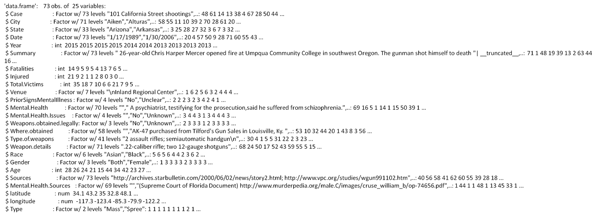
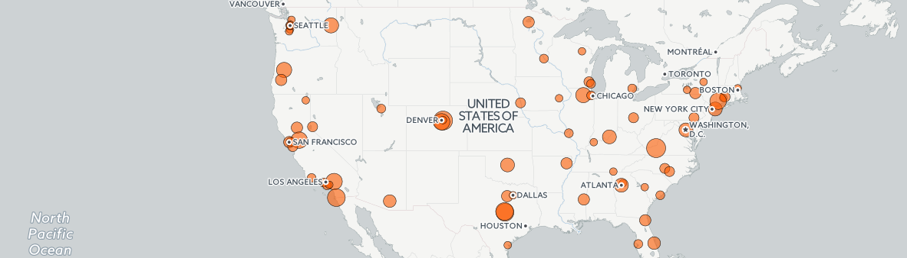
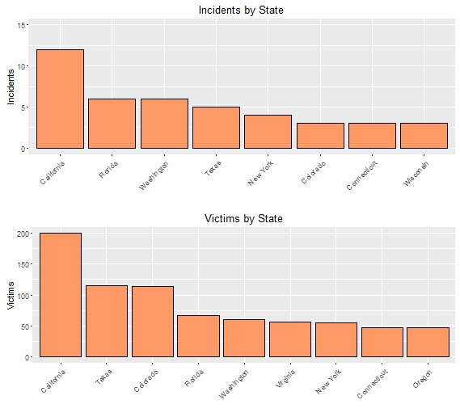
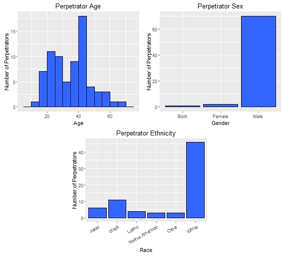

---
title: "Mass Shootings"
subtitle:  "Mother Jones Magazine Data"
author: "Matt Samelson"
date: "January 27, 2016"
output: ioslides_presentation
  
---


```{r, include=FALSE}
setwd("C:/Users/Matt/Dropbox/RClass/Data/data/MassShootings")
shootings <- read.csv("USMassShootings.csv",header=TRUE)
names(shootings)=tolower(names(shootings))
shootings_m = shootings[shootings$gender == 'Male',]
library(ggplot2)
library(knitr)
library(dplyr)
library(gridExtra)
library(vcd)
```

## Introduction

Gun control is a highly emotional and contentious issue.  There is limited data on gun-related incidents.  

This is the result of much political rangling.  

The nature of the issue is such that any data set put forth normally comes under considerable scrutiny.

There is massive misrepresention and lack of context in data presented which is intended to sensationalize the topic.

Mother Jones Magazine, a liberally-oriented investigative journalism publication, ran a series of articles on US Mass Shootings.  In response to challenges, they released their data.

This presentation focuses on the Mother Jones mass shooting data set.

##Objectives

1. Examine the Data

2. Understand the data characteristics

2. Make statistical inferences from the data as to the characteristics of perpetrators.  

## Mother Jones Magazine

**What Is Mother Jones?**

"Mother Jones is a nonprofit news outlet that delivers bold and original award-winning reporting on the urgent issues of our day, from politics and climate change to education and the food we eat. We investigate stories that are in the public and the nation's interest. From revelatory scoops to deep-dive investigations, Mother Jones journalism is penetrating storytelling that informs and inspires an engaged readership of 8 million monthly readers."

*From http://www.motherjones.com/about*

## The Data

* Small Dataset
  - 73 observations of 25 variables
  - Many categorical variables
  - in csv format (available also in txt and xls)
  - "Mass shooting" defined as an incident with 4 or more fatalities

* Data obtained from http://www.motherjones.com/politics/2012/12/mass-shootings-mother-jones-full-data

## Data 

```{r eval=FALSE}
#shootings <- read.csv("USMassShootings.csv",header=TRUE)
str(shootings)
```




## Mass Shootings 1982 - 2015 

Mapping

<center></center>


CartoDB: [Link] https://mksamelson.cartodb.com/viz/f246477c-a4cc-11e5-a726-0e3a376473ab/public_map

## Mass Shootings 1982 - 2015

Top States:  Incidents and Victims

<center></center>

## Mass Shootings 1982 - 2015

Total Victims

```{r echo=FALSE}

#Total Victims Histogram

ggplot(shootings,aes(total.victims))+
  geom_histogram(binwidth=5, colour='black', fill = 'orange')+
  #xlim(c(0,90))+
  xlab("Total Victims") +
  ggtitle("Mass Shootings in the US: 1982 - 2015")+
  ylab("")

```


## Mass Shootings 1982 - 2015

Fatalities and wounded

```{r echo=FALSE}


#Fatalities Histogram

fatalities.hist = ggplot(shootings,aes(fatalities))+
  geom_histogram(binwidth=5, colour='black', fill = 'blue')+
  #xlim(c(0,90))+
  xlab("Fatalities") +
  ylab("Number of Events") 

#Wounded Histogram

wounded.hist = ggplot(shootings,aes(injured))+
  geom_histogram(binwidth=5, colour='black', fill = 'green')+
  #xlim(c(0,90))+
  xlab("Wounded")+
  ylab("Number of Events")


grid.arrange(fatalities.hist,wounded.hist, ncol=1, nrow=2)
```

## Mass Shootings 1982 - 2015

<center>
```{r echo=FALSE}
ggplot(shootings,aes(year))+
  geom_bar(fill="#ff9966",colour="black")+ 
  xlab("Year")+
  ylab("Number of Events") +
  ggtitle("Events Per Year")

```

</center>

## Mass Shootings 1982 - 2015

<center>

```{r, echo=FALSE}

#Fatalities by Year

fatalities.year = ggplot(shootings,aes(year,fatalities))+
  stat_summary(fun.y=sum,geom="bar",colour="black",fill="#66CC99",show.legend = FALSE) +
  scale_y_continuous(limits=c(0,80))+
  ylab("Fatalities") +
  ggtitle("Fatalities")

#Wounded by Year

wounded.year = ggplot(shootings,aes(year,injured))+
  stat_summary(fun.y=sum,geom="bar",colour="black",fill="#CC6666",show.legend = FALSE) +
  scale_y_continuous(limits=c(0,80))+
  xlab("Year")+
  ylab("Wounded")+
  ggtitle("Wounded")

grid.arrange(fatalities.year, wounded.year, ncol=1, nrow=2)


```

</center>

## Mass Shootings 1982 - 2015

Perpetrator Age, Sex, and Ethnicity


<center></center>

## Mass Shootings 1982 - 2015

Male Perpetrators by Age and Ethnicity

<center>

```{r, echo=FALSE}
ggplot(shootings_m,aes(age,fill=race)) +
  geom_histogram(binwidth=5,position='stack',color='black')+
  xlab("Age") +
  ylab("Number of Perpetrators") + 
  ggtitle("Male Perpetrators by Age and Race")

```

</center>

## Mass Shootings 1982 - 2015

White Male Perpetrators - Density

<center>

```{r, echo=FALSE}

ggplot(shootings_m[shootings_m$race=='White',],aes(age)) + 
  geom_histogram(aes(y=..density..),binwidth=5,fill='#FE2EF7',color='black')+
  geom_density(size = 1)+
  ggtitle("White Male Perpetrators")
```

</center>
## Mass Shootings 1982 - 2015

Male Perpetrators - Density

<center>

```{r, echo=FALSE}
#Add Column to shootings to group non-White and Black Ethnicities

shootings_m = shootings[shootings$gender == 'Male',]

shootings_m$race_group = shootings_m$race

#Iterate through shootings_m and make only three bins: White, Black, and Other

for (i in 1:nrow(shootings_m)){
  if (shootings_m$race[i] != "White" & shootings_m$race[i] != "Black"){
    shootings_m$race_group[i] = "Other"
  } 
}

ggplot()+
  geom_density(aes(age), colour = "red", fill="red",alpha = .4, data=shootings_m[shootings_m$race_group == 'White',])+
  geom_density(aes(age), colour = "black", fill="black", alpha = .4, data=shootings_m[shootings_m$race_group == 'Black',])+
  geom_density(aes(age), colour = "green", fill="green",alpha = .4, data=shootings_m[shootings_m$race_group == 'Other',])+
  xlab("Age")+
  ylab("Density")+
  ggtitle("Age Densities by Ethnicity")


```

</center>

## Mass Shootings 1982 - 2015

<center>

```{r, echo=FALSE}

data=shootings_m
race.new = NA
race.new[which(data$race == "White")] = "White"
race.new[which(data$race != "White")] = "Other"
race.new = as.factor(race.new)

age.new = cut(data$age, c(13, 30, 50, 66),
              labels = c("13 - 30", "31 - 50", "51 - 66"),
              include.lowest = TRUE)

mosaic(table(race.new, age.new), shade = TRUE, legend = TRUE,
       labeling_args = list(set_varnames = c(race.new = "Race",
       age.new = "Age")))
  
  

```

## Mass Shootings 1982 - 2015

<center>

```{r, echo=FALSE}
ggplot(shootings,aes(age,total.victims))+
  geom_point()+
  xlab("Age")+
  ylab("Victims (Fatalities + Wounded)")+
  ggtitle("Perpetrator Age vs. Total Victims")
```
</center>

## Mass Shootings 1982 - 2015

<center>

```{r, echo=FALSE}
#weapons obtained legally

weapons.legally = ggplot(shootings,aes(weapons.obtained.legally))+
  geom_bar(color='black', fill='blue')  +
  ggtitle("Weapons Obtained Legally") + 
  xlab("")

#Mental Health Issues (advanced warning) - Bar Chart

mental.issues = ggplot(shootings,aes(mental.health.issues))+
  geom_bar(fill="green",colour="black")+ 
  ylab("Count") +
  xlab("")+
  ggtitle("Demonstrated Mental Health Issues")

grid.arrange(weapons.legally, mental.issues,ncol=1, nrow=2)

```
</center>


## Mass Shootings 1982 - 2015 {.smaller}

Top Events

<center></center>


## Mass Shootings 1982 - 2015

Conclusions

1.  Data yields results that provides insight by grouping.

2.  Observations not statistically significant/verifiable
