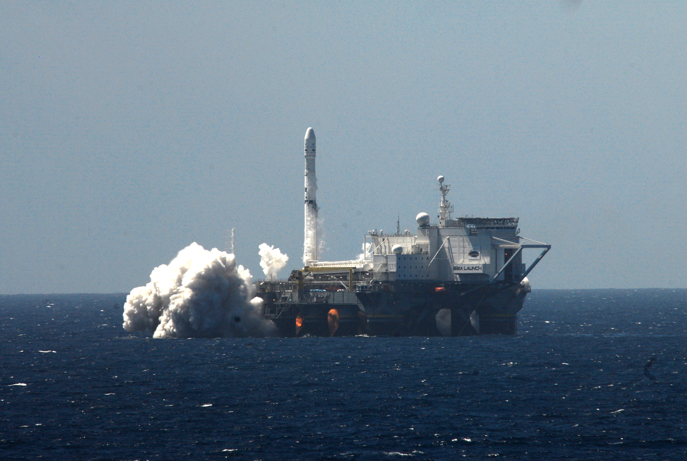

For my data visualization project, I looked at artificial satellite data from the [Union of Concerned Scientists](http://www.ucsusa.org/nuclear-weapons/space-weapons/satellite-database). It concerns the 1,305 operational satellites orbiting Earth as of the 31st of August, 2015. While there have been fascinating visualizations of space debris done by Google Earth and others, the UCS data contain satellite origin locations and ownership information useful for analyzing the overall industry.

## The Dataset

- Country of Origin
- Country of Operator
- Users
- Purpose
- Class of Orbit
- Type of Orbit
- Longitude of GEO
- Perigee & Apogee (km)
- Inclination (degrees)
- Period (minutes)
- Launch Mass (kg)
- Launch Date and Site
- Expected Lifetime
- Contractor (company or state)
- Country of Contractor
- Launch Vehicle


```{r echo=FALSE, message=FALSE}
library(dplyr)
library(ggplot2)
library(maps)
sat_data = read.csv('ucs_satellite_data.csv', header=TRUE, sep = '\t')
# remove empty columns
sat_data = select_(sat_data, "Name.of.Satellite..Alternate.Names", "Country.Org.of.UN.Registry", "Country.of.Operator.Owner",
                    "Operator.Owner", "Users", "Purpose",
                    "Detailed.Purpose", "Class.of.Orbit", "Type.of.Orbit",
                    "Longitude.of.GEO..degrees.", "Perigee..km.", "Apogee..km.",
                    "Eccentricity", "Inclination..degrees.", "Period..minutes.",
                    "Launch.Mass..kg..", "Dry.Mass..kg..", "Power..watts.",
                    "Date.of.Launch", "Expected.Lifetime", "Contractor",
                    "Country.of.Contractor", "Launch.Site", "Launch.Vehicle",
                    "COSPAR.Number", "NORAD.Number", "Comments",
                    "Source.Used.for.Orbital.Data", "Source", 
                    "Source.1", "Source.2", "Source.3",
                    "Source.4", "Source.5")

# add longitude and latitude
sat_data$Launch.Longitude[sat_data$Launch.Site == "Cape Canaveral"] = -80.553295
sat_data$Launch.Latitude[sat_data$Launch.Site == "Cape Canaveral"] = 28.458173
sat_data$Launch.Longitude[sat_data$Launch.Site == "Baikonur Cosmodrome"] = 63.313368
sat_data$Launch.Latitude[sat_data$Launch.Site == "Baikonur Cosmodrome"] = 45.859496
sat_data$Launch.Longitude[sat_data$Launch.Site == "Sriharikota Launch Station"] = 80.230349
sat_data$Launch.Latitude[sat_data$Launch.Site == "Sriharikota Launch Station"] = 13.719763
sat_data$Launch.Longitude[sat_data$Launch.Site == "Satish Dhawan Space Centre"] = 80.230349
sat_data$Launch.Latitude[sat_data$Launch.Site == "Satish Dhawan Space Centre"] = 13.719763
sat_data$Launch.Longitude[sat_data$Launch.Site == "Jiuquan Satellite Launch Center"] = 100.297835
sat_data$Launch.Latitude[sat_data$Launch.Site == "Jiuquan Satellite Launch Center"] = 40.960633
sat_data$Launch.Longitude[sat_data$Launch.Site == "Kodiak Launch Complex"] = -152.339776
sat_data$Launch.Latitude[sat_data$Launch.Site == "Kodiak Launch Complex"] = 57.435228
sat_data$Launch.Longitude[sat_data$Launch.Site == "Palmachim Launch Complex"] = 34.68020
sat_data$Launch.Latitude[sat_data$Launch.Site == "Palmachim Launch Complex"] = 31.88484
sat_data$Launch.Longitude[sat_data$Launch.Site == "Guiana Space Center"] = -52.76950  
sat_data$Launch.Latitude[sat_data$Launch.Site == "Guiana Space Center"] = 5.23739
sat_data$Launch.Longitude[sat_data$Launch.Site == "Vandenberg AFB"] = -120.60124   
sat_data$Launch.Latitude[sat_data$Launch.Site == "Vandenberg AFB"] = 34.77204
sat_data$Launch.Longitude[sat_data$Launch.Site == "Plesetsk Cosmodrome"] = 39.676272
sat_data$Launch.Latitude[sat_data$Launch.Site == "Plesetsk Cosmodrome"] = 62.700615
sat_data$Launch.Longitude[sat_data$Launch.Site == "Taiyuan Launch Center"] = 111.96741
sat_data$Launch.Latitude[sat_data$Launch.Site == "Taiyuan Launch Center"] = 39.14321
sat_data$Launch.Longitude[sat_data$Launch.Site == "Tanegashima Space Center"] = 130.96813
sat_data$Launch.Latitude[sat_data$Launch.Site == "Tanegashima Space Center"] = 30.39096
sat_data$Launch.Longitude[sat_data$Launch.Site == "Wallops Island Flight Facility"] = -75.47938
sat_data$Launch.Latitude[sat_data$Launch.Site == "Wallops Island Flight Facility"] = 37.84621
sat_data$Launch.Longitude[sat_data$Launch.Site == "Naro Space Center"] = 127.52793
sat_data$Launch.Latitude[sat_data$Launch.Site == "Naro Space Center"] = 34.42585
sat_data$Launch.Longitude[sat_data$Launch.Site == "Satish Dhawan Space Center"] = 80.230349
sat_data$Launch.Latitude[sat_data$Launch.Site == "Satish Dhawan Space Center"] = 13.719763
sat_data$Launch.Longitude[sat_data$Launch.Site == "Xichang Satellite Launch Center"] = 102.02814
sat_data$Launch.Latitude[sat_data$Launch.Site == "Xichang Satellite Launch Center"] = 28.24646
sat_data$Launch.Longitude[sat_data$Launch.Site == "Dombarovsky Air Base"] = 59.85003
sat_data$Launch.Latitude[sat_data$Launch.Site == "Dombarovsky Air Base"] = 51.20706
sat_data$Launch.Longitude[sat_data$Launch.Site == "Uchinoura Space Center"] = 131.07914
sat_data$Launch.Latitude[sat_data$Launch.Site == "Uchinoura Space Center"] = 31.25186
sat_data$Launch.Longitude[sat_data$Launch.Site == "Svobodny Cosmodrome"] = 128.27570
sat_data$Launch.Latitude[sat_data$Launch.Site == "Svobodny Cosmodrome"] = 51.83441
sat_data$Launch.Longitude[sat_data$Launch.Site == "Kwajalein Island"] = 167.65457
sat_data$Launch.Latitude[sat_data$Launch.Site == "Kwajalein Island"] = 8.99948

# cleaning more data
sat_data$Country.Org.of.UN.Registry[sat_data$Country.Org.of.UN.Registry == ""] = "NR"
sat_data$Country.Org.of.UN.Registry[grep("^NR ", sat_data$Country.Org.of.UN.Registry)] = "NR"
sat_data$Country.Org.of.UN.Registry[grep("^Korea", sat_data$Country.Org.of.UN.Registry)] = "South Korea"

sat_data[,"Country.of.Operator.Owner"] = sapply(sat_data[,"Country.of.Operator.Owner"], as.character)
sat_data$Country.of.Operator.Owner[917] = "United Kingdom/Ukraine"

sat_data$Users[grep("^Military ", sat_data$Users)] = "Military"
sat_data$Users[grep("Commerical", sat_data$Users)] = "Commercial"

sat_data$Class.of.Orbit[grep("LEO ", sat_data$Class.of.Orbit)] = "LEO"

sat_data$Longitude.of.GEO..degrees.[sat_data$Class.of.Orbit != "GEO"] = NA

sat_data$Date.of.Launch = as.Date(sat_data$Date.of.Launch, "%m/%d/%Y")

sat_data$Country.of.Contractor[sat_data$Country.of.Contractor == "United Kingdom"] = "UK"
sat_data$Country.of.Contractor[sat_data$Country.of.Contractor == "USA "] = "USA"
sat_data$Country.of.Contractor[sat_data$Country.of.Contractor == "Russia "] = "Russia"
sat_data$Country.of.Contractor[sat_data$Country.of.Contractor == "France, UK, Germany"] = "France/UK/Germany"
sat_data$Country.of.Contractor[sat_data$Country.of.Contractor == "International"] = "Multinational"
sat_data$Country.of.Contractor[sat_data$Country.of.Contractor == "PR China"] = "China"
sat_data$Country.of.Contractor[sat_data$Country.of.Contractor == "China "] = "China"

sat_data$Launch.Site[sat_data$Launch.Site == "Satish Dhawan Space Center"] = "Satish Dhawan Space Centre"

sat_data$Perigee..km. = as.numeric(gsub(",", "",sat_data$Perigee..km.))
sat_data$Apogee..km. = as.numeric(gsub(",", "", sat_data$Apogee..km.))

sat_data$Longitude.of.GEO..degrees.[584] = NA
sat_data$Longitude.of.GEO..degrees.[585] = NA
sat_data$Longitude.of.GEO..degrees.[588] = NA
sat_data$Longitude.of.GEO..degrees.[836] = NA
```


## Launching Countries

The data is collected from multiple sources. First, the Convention on Registration of Objects Launched into Outer Space requires that countries report satellite information to the United Nations Office of Outer Space Affairs. Even so, some countries neglect to report launches of covert satellites. However, other countries act as watchdogs, reporting when they detect a foreign satellite launch. Amateur astronomers also fulfill this watchdog role.

Next we can look at the launching state of these satellites. While 25% of satellite origin countries are labeled "NR" (Not Reported), many of these are new satellites that are not yet labeled. These values are therefore missing at random (MAR) with respect to time and do not severely undermine the analysis. Using *dplyr* and *ggplot2*, we can group the most active satellite origin countries and plot them on the world map:
```{r}
group_by(sat_data, Country.Org.of.UN.Registry) %>% 
  summarise(count_from_orig_country = n()) %>% 
  arrange(desc(count_from_orig_country))
```

```{r, echo=FALSE, fig.align='center'}
country_origin_df = group_by(sat_data, Country.Org.of.UN.Registry) %>% summarise(origins_per_country = n()) %>% arrange(desc(origins_per_country))
country_origin_df$Country.Org.of.UN.Registry = as.character(country_origin_df$Country.Org.of.UN.Registry)
country_origin_df$Country.Org.of.UN.Registry[country_origin_df$Country.Org.of.UN.Registry=="United Kingdom"] = "UK" # for consistency

new_world_map_df = merge(map_data("world"), country_origin_df, by.x="region", by.y="Country.Org.of.UN.Registry", all.x=T)
new_world_map_df_sorted = new_world_map_df[order(new_world_map_df$order),] #it somehow lost its indexing
rownames(new_world_map_df_sorted) = 1:nrow(new_world_map_df_sorted)
```
```{r, fig.align='center'}
ggplot(data=new_world_map_df_sorted, aes(x=long, y=lat, group=group, fill=origins_per_country)) + 
  geom_polygon() +
  theme(legend.position="bottom", 
        axis.title.x=element_blank(), 
        axis.title.y=element_blank(), 
        axis.ticks=element_blank(), 
        axis.text.x=element_blank(), 
        axis.text.y=element_blank()) +
  scale_fill_continuous(name = "Origins per Country") +
  coord_equal() +
  ggtitle("Satellites by Country of Origin")
```

## Launch Sites

The launch site with the most satellites currently in orbit is the Baikonur Cosmodrome in Kazakhstan, one of the main launch sites of the Russian space program. The second busiest launch site is in French Guiana where the European Space Agency performs most of its launches.
```{r}
group_by(sat_data, Launch.Site) %>%
  summarise(Launches_per_site = n()) %>%
  arrange(desc(Launches_per_site))
```
And here are launch locations on the world map:
```{r warning=FALSE, fig.align='center'}
launch_site_df = group_by(sat_data, Launch.Site) %>% summarise(Launches_per_site = n())
ggplot() + geom_polygon(data = map_data("world"), aes(x = long, y = lat, group = group)) + 
  geom_point(aes(x=sat_data$Launch.Longitude, 
                 y=sat_data$Launch.Latitude, 
                 col="red", 
                 size=launch_site_df$Launches_per_site[sat_data$Launch.Site])) +
  theme(legend.position="none", 
        axis.title.x = element_blank(), 
        axis.title.y = element_blank(), 
        axis.ticks = element_blank(), 
        axis.text.x = element_blank(), 
        axis.text.y = element_blank()) +
  coord_equal() +
  scale_size_continuous(range = c(1, 3.5)) +
  ggtitle("Satellite Launch Pads by Number of Launches")
```
</center>
### Other Launch Sites

There are currently 26 working satellites in orbit launched from Odyssey, a mobile drilling rig turned launch pad.

<center></center>
<center><font size="1">Source: https://exploringbeyondfinalfrontiers.wordpress.com/tag/eutelsat/</font></center>

4 other sea launches took place. While the dataset lacked more details, submarines are also capable of launching small satellites into orbit. Since a submarine can launch from nearly anywhere in the open ocean, this is currently the most likely way that a completely anonymous satellite can enter orbit.

1 current satellite was launched from an L-1011 Aircraft, as shown here:

<center></center>
<center><font size="1">Source: https://i.ytimg.com/vi/m7_yyvGxwrE/hqdefault.jpg</font></center>

24 satellites were launched from the International Space Station. While I originally thought this classification was due to human error, small research satellites do launch from the ISS (shown below). The data show they are research satellites of approximately 4kg of mass each and are in polar low earth orbits.

<center><iframe width="560" height="315" src="https://www.youtube.com/embed/AdtiVFwlXdw" frameborder="0" allowfullscreen></iframe></center>

The dataset groups the uses of satellites into civil (academic or amateur), commercial, government (meteorological, scientific, etc.), or military. I next looked at these purposes by the three largest satellite launching countries and others. I also looked at the "Not Reported" country of origin of satellites to identify any trends.

```{r, echo=FALSE, fig.align='center'}
# 4 main uses of satellites
sat_users_df = sat_data[sat_data$Users=="Civil" | sat_data$Users=="Commercial" | sat_data$Users=="Military" | sat_data$Users=="Government", ]
#looking at who uses the US, Russia, China, or Europe
sat_users_df_main_countries = sat_users_df[sat_users_df$Country.Org.of.UN.Registry=="USA" | sat_users_df$Country.Org.of.UN.Registry=="Russia" | sat_users_df$Country.Org.of.UN.Registry=="China",]

sat_users_df$main_countries = as.character(sat_users_df$Country.Org.of.UN.Registry)
sat_users_df$main_countries[sat_users_df$main_countries != "USA" & sat_users_df$main_countries != "Russia" & sat_users_df$main_countries != "China" & sat_users_df$main_countries != "NR"] = "Other"
ggplot(sat_users_df, aes(Users, fill=sat_users_df$main_countries)) + 
  geom_bar(position="dodge") +
  theme(legend.position="bottom") + 
  scale_fill_discrete("") + 
  xlab("Use") + 
  ggtitle("Satellite Uses by Country")
```

## Orbits

The types of artificial satellite orbit are Low Earth Orbit (LEO) under 2,000 km in altitude, Medium Earth Orbit (MEO) between 2,000 km and 35,786 km in altitude, Geosynchronous Orbit (GEO) at 35,786 km in altitude, and Elliptic Orbit which deviates from the previous near-circular orbits. The majority of working satellites are in low Earth orbit, but they are also the most likely to first burn up in the atmosphere. With the exception of the Apollo missions, astronauts have only flown low Earth orbits.
```{r echo=FALSE}
orbit_class_df = group_by(sat_data, Class.of.Orbit) %>%
  summarise(number_per_orbit = n()) %>%
  arrange(desc(number_per_orbit))
orbit_class_df

orbit_class_df = sat_data %>%
  mutate(Distance = (Perigee..km. + Apogee..km.)/2)

orbit_class_df_small = orbit_class_df[orbit_class_df$Class.of.Orbit != orbit_class_df$Class.of.Orbit[33],]
```

I estimated the distance of a satellite from the Earth to be the mean of its Perigee and Apogee. While excel has conditioned  many of us (including me) to simply plot group means on bar charts for comparison, the following plot presents more facets about the data. By presenting a scatter plot with jittering, we can visualize each orbit type's mean distance from Earth and its distance variance.

```{r warning=FALSE, fig.align='center'}
ggplot(orbit_class_df_small, aes(1, Distance, col=Class.of.Orbit)) + 
  geom_point(alpha=.5, position=position_jitter(width=1)) +
  theme(legend.position = "bottom", 
        axis.title.x = element_blank(), 
        axis.text.x = element_blank(),
        axis.ticks.x = element_blank()) +
  scale_colour_discrete(name = "Orbit Class") +
  ggtitle("Mean Satellite Distance from Earth")
```

```{r warning=FALSE, fig.align='center', echo=FALSE}
ggplot(orbit_class_df_small[orbit_class_df_small$Class.of.Orbit == "LEO",], aes(1, Distance)) + 
  geom_point(col="green", alpha=.5, position=position_jitter(width=1))+
  theme(legend.position="bottom", 
        axis.title.x = element_blank(), 
        axis.text.x = element_blank(),
        axis.ticks.x = element_blank()) +
  #add ISS
  geom_point(data=data.frame(distance=382.5), aes(1, distance), col="orange", size=3) +
  ggtitle("Low Earth Orbits in Detail") + 
  geom_text(data = data.frame(distance=382.5), aes(x = 1, y = distance*.9, label = "International Space Station"))
```

```{r warning=FALSE, fig.align='center', echo=FALSE}
ggplot(orbit_class_df_small[orbit_class_df_small$Class.of.Orbit == "GEO",], aes(1, Distance)) + 
  geom_point(col="red", alpha=.5, position=position_jitter(width=1))+
  theme(legend.position="bottom", 
        axis.title.x = element_blank(), 
        axis.text.x = element_blank(),
        axis.ticks.x = element_blank()) +
  ylim(c(35775, 35800)) +
  ggtitle("Geosynchronous Orbits in Detail")
```

The majority of geosynchronous orbiting satellites are ± 1 km of the equilibrium distance of 35,786 km. Even though the UCS dataset claims not to give enough information to find a single satellite's exact location, it does contain the longitudes of geosynchronous satellites. Since geosynchronous satellites orbit above the equator at the same rate as the Earth's rotation, I was able to plot the locations of geosynchronous satellites based on their longitudes. Positive longitudes correspond to "degrees east" and negative longitudes correspond to "degrees west".

```{r fig.align='center', echo=FALSE, warning=FALSE, message=FALSE}
sat_users_df$Longitude.of.GEO..degrees.[584] = NA
sat_users_df$Longitude.of.GEO..degrees.[585] = NA
sat_users_df$Longitude.of.GEO..degrees.[588] = NA
sat_users_df$Longitude.of.GEO..degrees.[836] = NA
ggplot(sat_users_df, aes(Longitude.of.GEO..degrees.)) +
geom_polygon(data=new_world_map_df_sorted, aes(x=long, y=lat, group=group)) +
  theme(legend.position="bottom",
        axis.ticks=element_blank()) +
  coord_equal() +
  geom_histogram(aes(fill=main_countries), alpha=.85, bins=30) +
  ggtitle("Satellites in Geosynchronous Orbit by Longitude") +
  ylab("Count of Satellites") + xlab("Longitude of GEO Satellite") + scale_fill_discrete(name = "Principal Countries")
```

```{r echo=FALSE, warning=FALSE, message=FALSE}
d3df = orbit_class_df_small[,c("Name.of.Satellite..Alternate.Names","Country.Org.of.UN.Registry","Users","Purpose","Class.of.Orbit","Period..minutes.","Launch.Mass..kg..","Date.of.Launch","Launch.Site","Distance")]
#write.csv(d3df, file="/Users/tkolasa/dev/nycdatascience/projects/project1/d3df.csv", row.names = FALSE)
```


## Visualizing Satellite Distance Using D3.js

My next exploration of the data used the JavaScript library D3.js. The following visualization once again shows satellite distance from Earth randomly jittered along the x-axis, this time with detailed satellite information on hovering. Selecting specific countries allows the user to dynamically investigate specifics about a country's satellites. 


<iframe
  style="border: 0px;"
  src="http://www.thomaskolasa.com/satellites_d3/"
  scrolling="no"
  width="100%"
  height="1000px">
</iframe


