# Trucking

## The trucking industry is the lifeline of the U.S. economy. 
<div class="columns-3">

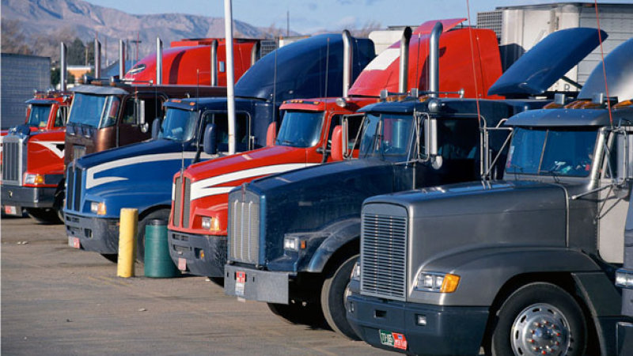
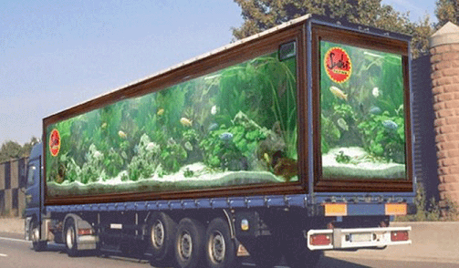
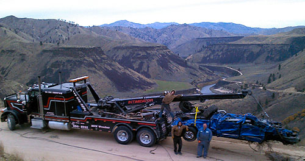
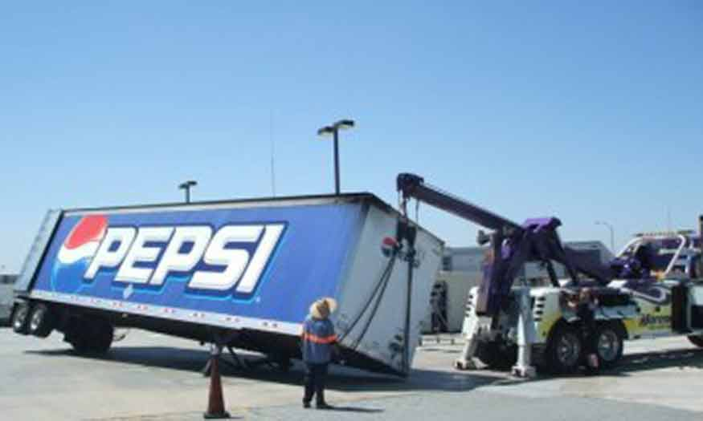
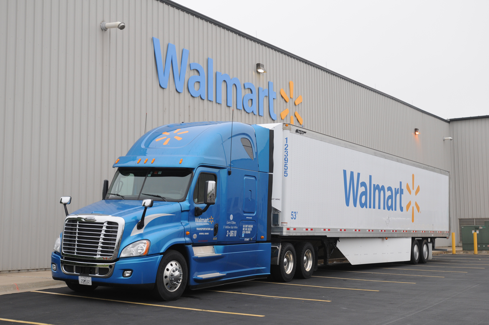
</div>


## Why

#### **Nearly 70% of all the freight tonnage moved in the U.S. goes on trucks**
<br>


#### **Without the industry and our truck drivers, the economy would come to a standstill**
<br>

- Move 9.2 billion tons of freight annually 
- Requires nearly 3 million heavy-duty Class 8 trucks 
- Over 3 million truck drivers 
- Uses over 37 billion gallons of diesel fuel  

## And
#### **Simply – without trucks, America stops**

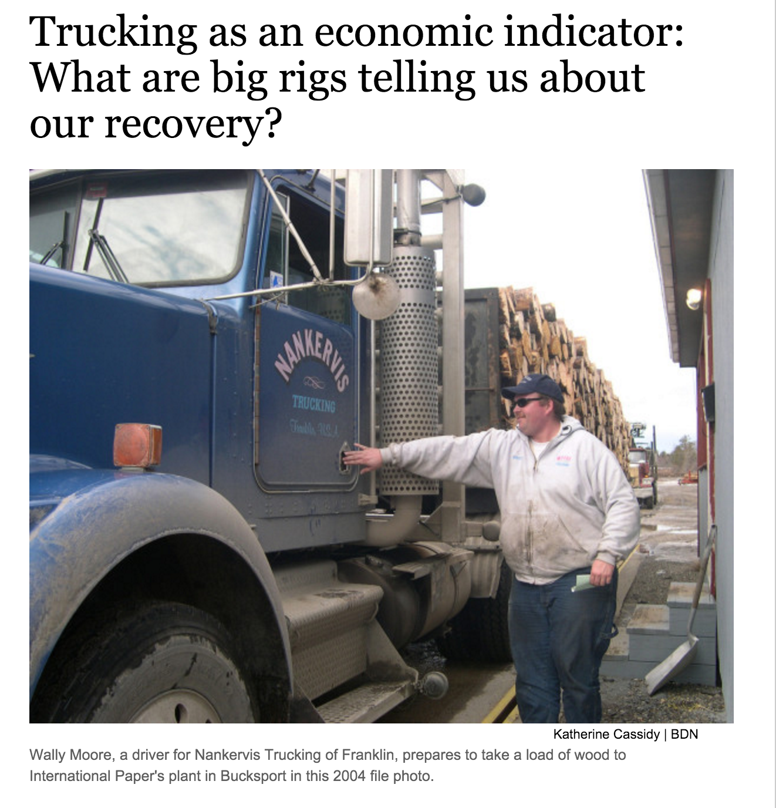

## FMCSA 
###### The 
###### Federal 
###### Motor 
###### Carrier 
###### Safety 
###### Administration


## Data by CD-ROM in 4-6 Weeks

State of affairs has not changed: same process in 2005, 2008, and 2010
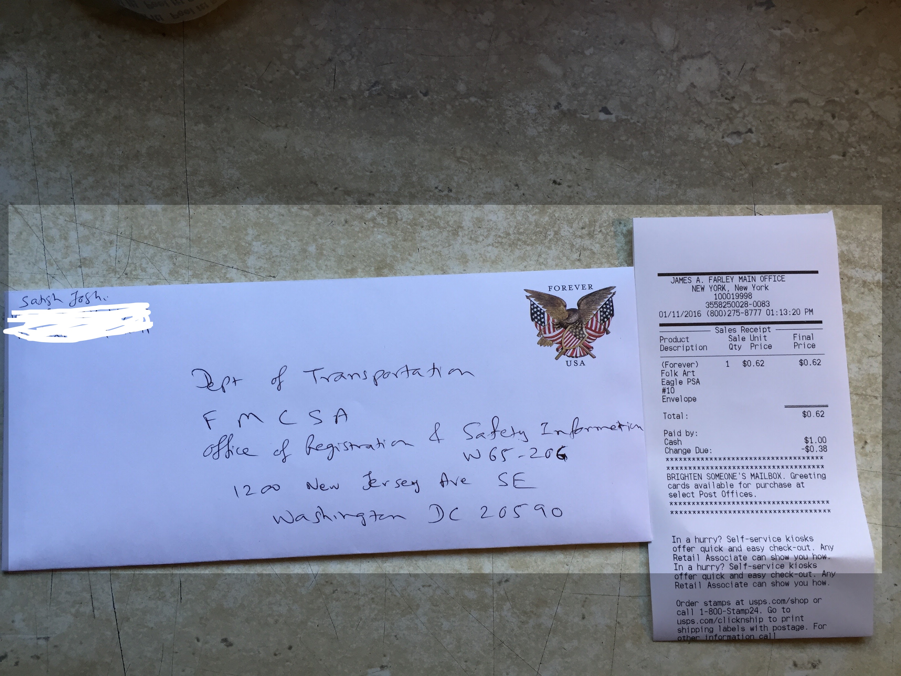

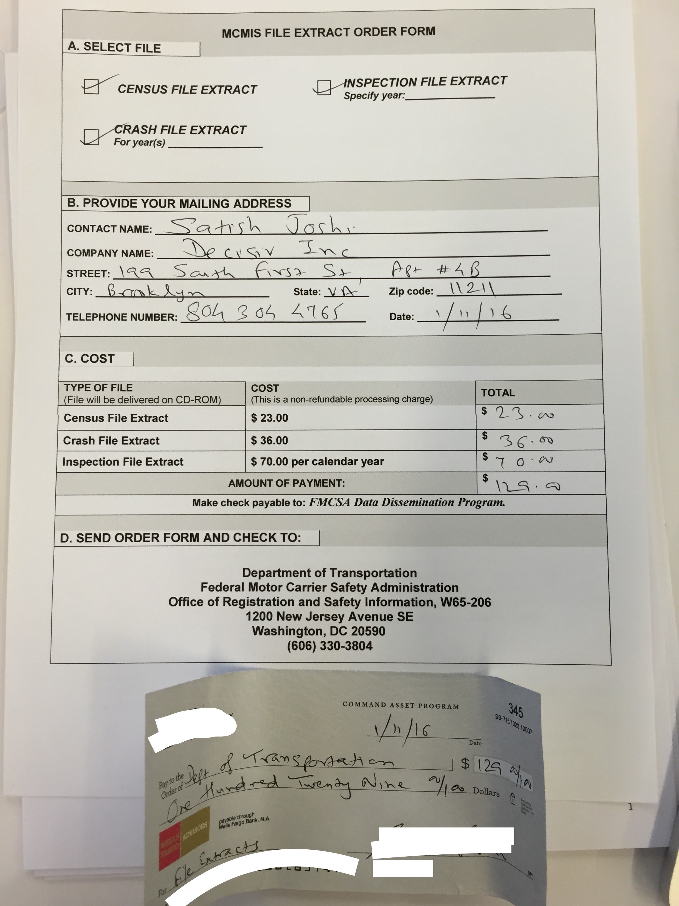

## Census Data Summary

````{r, eval = FALSE}
nrow(fleet_data)
summary(fleet_data$NBR_POWER_UNIT)
summary(fleet_data$DRIVER_TOTAL)
summary(fleet_data$MCS150_MILEAGE)
```

````{r, eval = FALSE}
> nrow(fleet_data)  
[1] 1643373  
> summary(fleet_data$NBR_POWER_UNIT)
   Min. 1st Qu.  Median    Mean 3rd Qu.    Max. 
      0       1       1       5       2  599900 
> summary(fleet_data$DRIVER_TOTAL)
    Min.  1st Qu.   Median     Mean  3rd Qu.     Max. 
0.00e+00 1.00e+00 1.00e+00 5.25e+00 2.00e+00 3.00e+05 
> summary(fleet_data$MCS150_MILEAGE)
     Min.   1st Qu.    Median      Mean   3rd Qu.      Max. 
0.000e+00 0.000e+00 1.200e+03 2.747e+05 4.000e+04 9.990e+09 
```

##Outliers
````{r, eval = FALSE, font_adjustmen = -10}
> fleets_outlier[,c("LEGAL_NAME", "MCS150_DATE", "PHY_STATE",
                    "DRIVER_TOTAL", "NBR_POWER_UNIT", "MCS150_MILEAGE")]

  LEGAL_NAME     MCS150_DATE PHY_STATE DRIVER_TOTAL NBR_POWER_UNIT MCS150_MILEAGE
ALL RESTORED INC   17-DEC-15        DE       299998              1        0
507 TRUCKING INC.  18-DEC-15        CA       299971         599941        0
```


````{r, eval = FALSE, font_adjustmen = -10}
> fleet_data[fleet_data$NBR_POWER_UNIT == 599941,
           c("DOT_NUMBER", "LEGAL_NAME", "EMAIL_ADDRESS", "PHY_ZIP")]
           
        DOT_NUMBER        LEGAL_NAME             EMAIL_ADDRESS PHY_ZIP
1255558    2833526 507 TRUCKING INC. LAURASPERMITS@HOTMAIL.COM   92879
```

## Trucker and Truck Population by States
````{r, eval = FALSE, font_adjustmen = -10}
STATE_UNITS = 
  state_choropleth(
   by_state_only, 
   title = "Vehicle Population", 
   legend = "Vehicles", 
   num_colors = 1, 
   zoom = NULL)
```
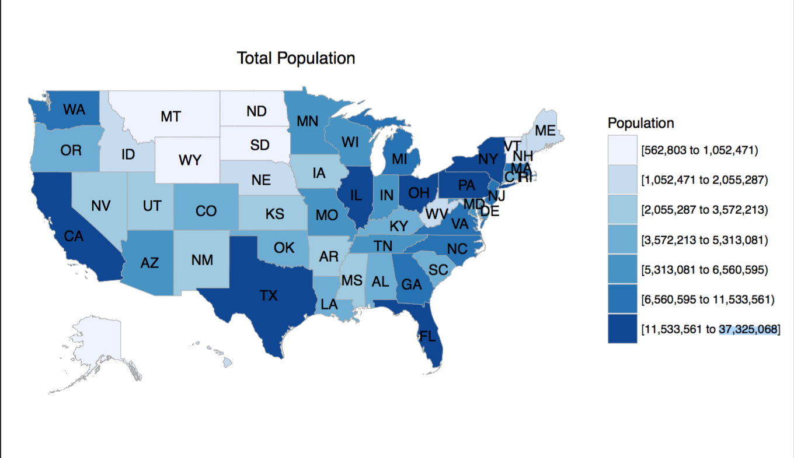
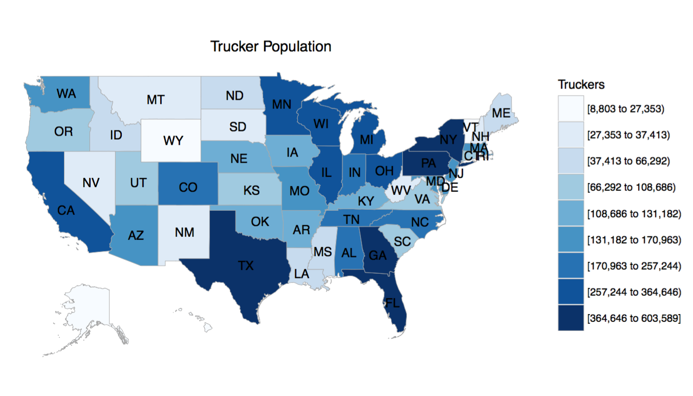
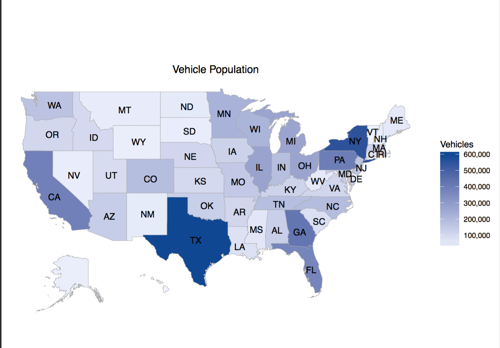

## Top Trucking States

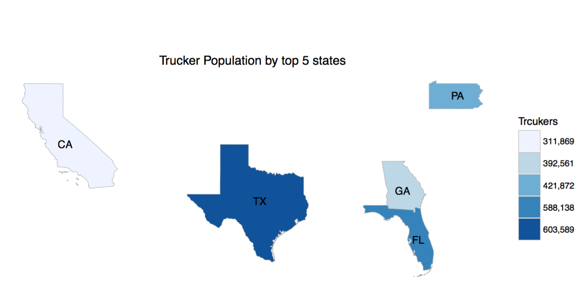

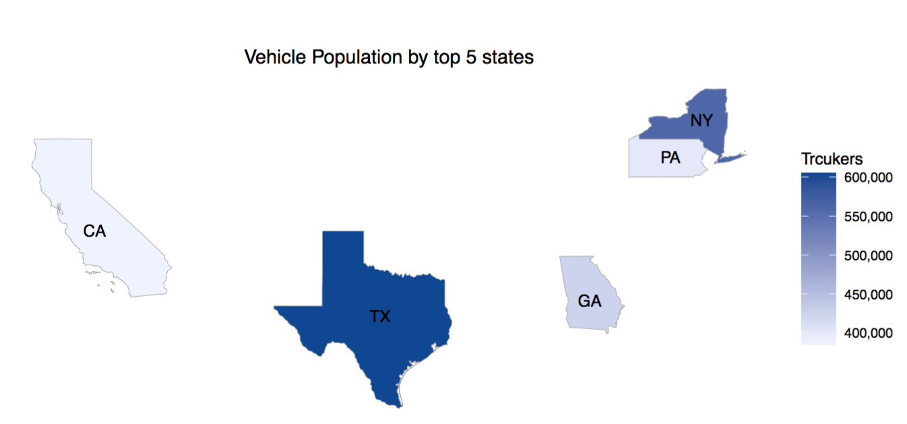

  


## Trucker Population by Zipcode

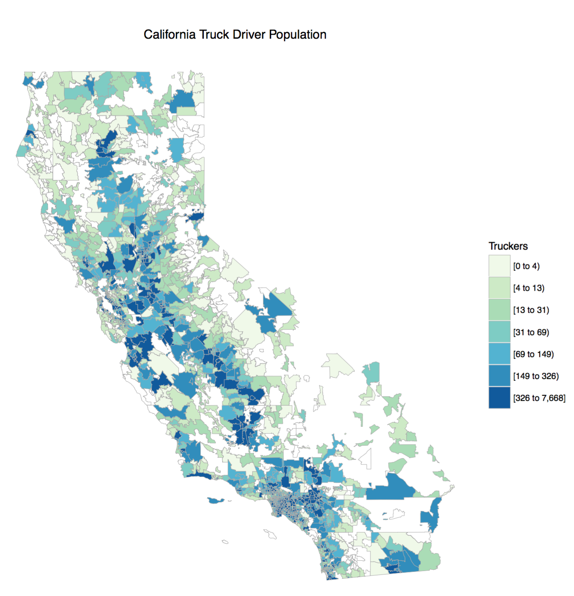

ZipChoropleth
<br>
does not produce country wide 
<br>
by zipcode map

## Fleet Types and Truckers & Trucks

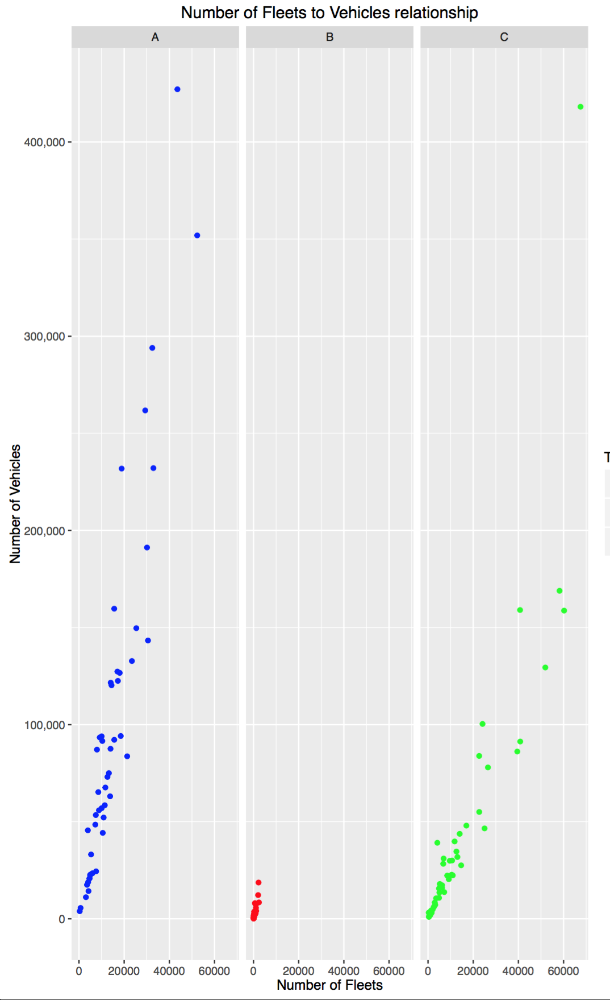

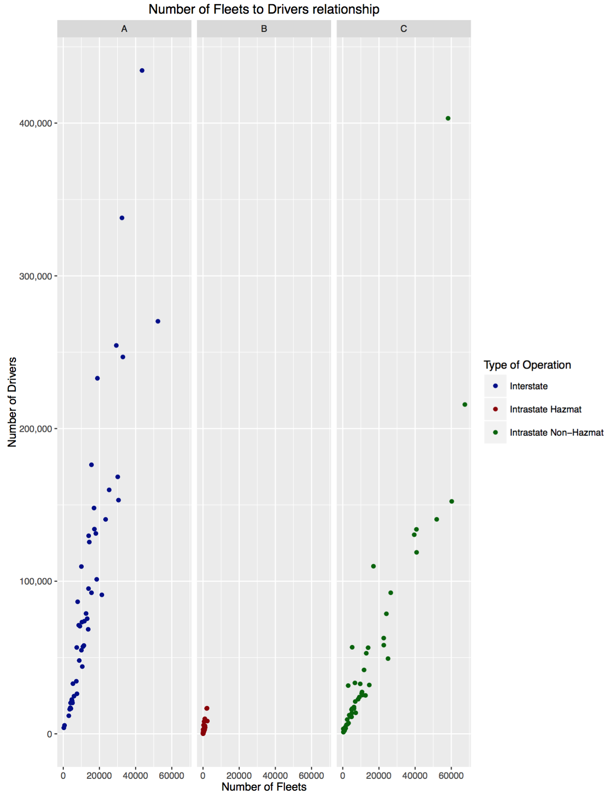

## Trucker to Truck Relationship
````{r, eval = FALSE}
fleets_try = subset(
  fleets, (NBR_POWER_UNIT < 2000) & 
    (DRIVER_TOTAL < 1000))
driver_unit_plot = ggplot(
  fleets_try, aes(NBR_POWER_UNIT, 
                  DRIVER_TOTAL )) +
  geom_point(
    aes(color=CARRIER_OPERATION)) +
  xlab("Number of Units") + 
  ylab("Number of Drivers") +
ggtitle("Number of Drivers to Units relationship") 
```

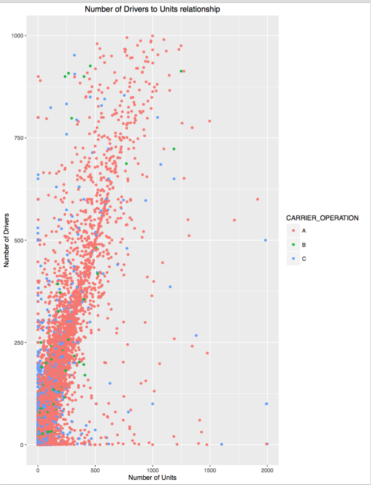

## Next Steps

- Analysis of inspection done: Issues with data coding

- Relationship between fleets and inspections done

- 