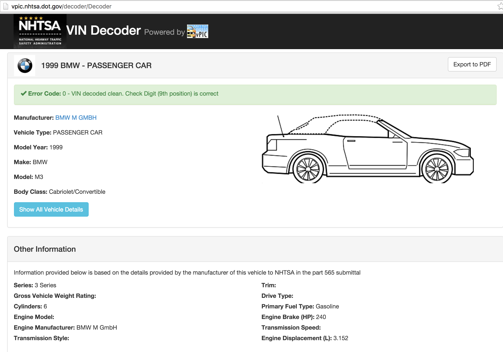
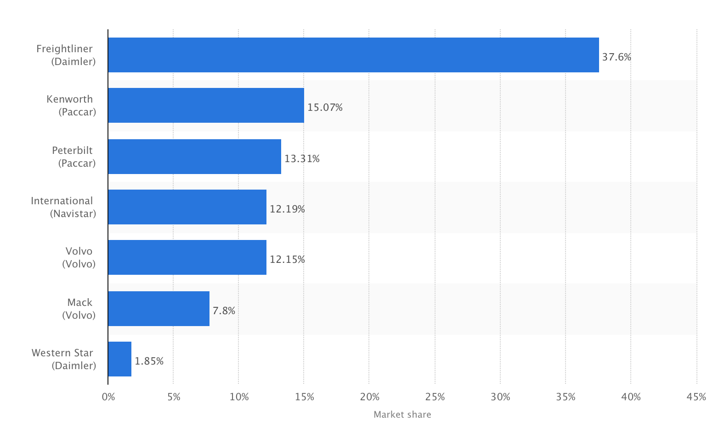

Truck Inspections and Crashes 
=============================
 
 
## Sources of Data
 
 
### Motor Carrier Inspection Information

The inspection file contains identifying information for the inspection such as the U.S. DOT#, Report Number, Inspection Date, State, and Vehicle Information. It also includes information about the relationship of each inspection to SMS BASIC information, and violation counts by BASIC.
 
 
### Motor Carrier Crash Information

The file contains a record for each commercial motor vehicle involved in a crash including the U.S. DOT#, Report Number, Crash Date, State, and Vehicle Information. It also includes information about the severity of the crash (tow-away, injury, fatal) and the associated severity and time weights used in the SMS. 

 
 
## Vehicle Informartion 
 
 
17 digit VIN - basic vehicle info like Make, Model, Engine, Year, and Serial Number
 
 
Data captured for VIN for inspections and crah files is pretty bad
 
 

## VIN Decoding 
 
 
**17 digit VIN to vehicle info**
 
 
[VIN Decoder] (http://vpic.nhtsa.dot.gov/) - diffrent branch of government providing APIs
 
 
Used it to map Make information for vehicles inspected and involved in crashes

## VIN Decoding Sample
 
 

 
 
## Truck market share by Brands
 
 

 
 
Freightliner - 800 lb gorilla, owned by Daimler, German
 
Paccar       - owns two brands: Kenworth & Peterbilt
 
Volvo Trucks - owns two brands: Volvo and Mack
 
International- Navistar: International Harvest Company
 
_There are other manufacturers including Japanese brands like Isuzu and Hino_
 

