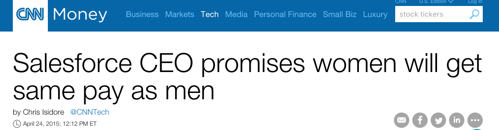
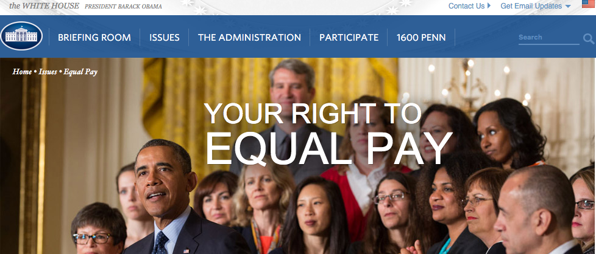
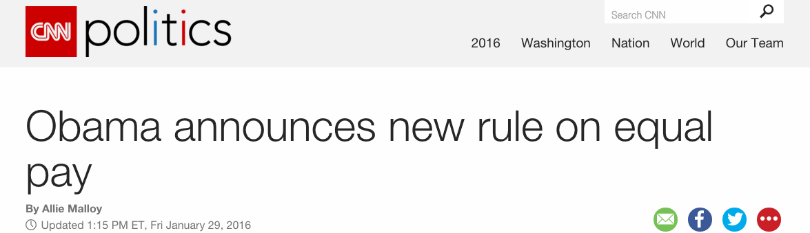

<center><h2>Background</h2></center>

###Saleforce closing gender pay gap (nov. 2015):
<br><center>
<a href="http://money.cnn.com/2015/04/24/technology/salesforce-equal-pay/">

</a></center><br>

<font size="4">

* Salesforce shows that 70 percent of their staff is male. 
* At leadership position, 85 percent are male. 
* salesforce reviewed 17,000 employee payroll.
* They spent 3 million extra to fix gender pay gap, and set the goal to have women make up at least 30 percent of the attendees at any meeting.  

</font>

###From the White House:
<br><center>
<a href="https://www.whitehouse.gov/issues/equal-pay">

</a></center><br>
<font size="4">

*  Full-time women workers’ earnings are only about 78 percent of their male counterparts’ earnings 
*  Pay discrimination is a real and persistent problem that continues to shortchange American women and their families.

</font>

###Actions in the U.S.:
<br><center>
<a href="http://www.cnn.com/2016/01/29/politics/obama-equal-pay-action-rules/">

</a></center><br>
<font size="4">

* The **Equal Pay Act of 1963** signed by John F. Kennedy, aimed at abolishing wage disparity based on sex. 
* In **April of 2014**, President Obama signed an Executive Order to prevent workplace discrimination by requiring federal contractors to submit data on employee compensation by race and gender. 
* **January 29, 2015**: Equal Employment Opportunity Commission will require companies with more than 100 employees to report salary data by gender, race, and ethnicity. First report due in September 2017.

</font>

<br><center><h2>Data exploration</h2></center>

<font size="4">
Use the App below to explore changes of income and gender pay gap over the past 30 years, and see how different factors influence the pay gap.

How to use the App:

1. Select a factor you would like to explore, and click "Update View".
2. Move mouse over to the bubbles to identify each group.
3. Click play button to view changes over time.
4. View bar chart/line chart by selecting tabs at upper right corner
5. Switch y-axis to "Difference_Income_Norm" to see different effects

</font>
All data are collected from <a href="https://www.census.gov/hhes/www/income/data/historical/people/">United States Census Bureau.</a>

```{r, echo=FALSE}
library(shiny)
library(googleVis)
#set factors
factors<-c("Education","Race","Region","Marital_Status","Work_time","Job_type")
#load data
#setwd("~/Desktop/nyc DSB/Shiny")
all<-read.table("AllIncomeData.txt",header=T,sep="\t")

fluidPage(
  #headerPanel("Gender Pay Gap in the United States"),

  sidebarPanel(
      selectInput("factor","Select a factor",
                  choices=factors),
      submitButton("Update View")
      ),
  
  mainPanel(
    tabsetPanel(
      tabPanel("View Data",h4("Yearly income"),htmlOutput("motionchart"),
               br(),
               helpText("Notes:",br(),
                        "* Average_Income: average yearly income, male and female combine, adjusted by population", br(),
                        "* Population: total number of working force (in thousands)", br(),
                        "* Difference_Income: median male income - median female income", br(),
                        "* Difference_Population: number of working male - number of working female", br(),
                        "* Difference_Income_Norm: difference_income normalize by average_income"), br(), br())
    )
  )
)

  mydata <- reactive({
    tb<-subset(all, factor%in%input$factor)
    tb<-tb[,-c(2:5,7)]
    tb$GroupID<-as.numeric(tb$group)
    return(tb)
  })
  
  output$motionchart<- renderGvis({
    motion=gvisMotionChart(mydata(), 
                           idvar="group", 
                           timevar="Year",
                           xvar="Average_Income",yvar="Difference_Income",
                           sizevar="Population",colorvar="GroupID")
    return(motion)
  })
    
```

<br><center><h2>Summary</h2></center><br>
<font size="4">

From exploring the data above, here are some of my observations:

* Over the years, the absolute differences in average income between men and women have increased. However, percent differences in average income between men and women have decreased. (To see these effects, select "Difference_Income" and "Difference_Income_Norm" at y-axis.) 
* In 1970s, men made about 80% to 100% more than women. In 2014, men made about 20% more than women. 
* Gender pay gap has reduced for the past few decades, but remain largely unchanged for the past 5 years. 
* **Education factor**: pay gap for people with a master or doctoral degree is the lowest and remain unchanged for the past decades. There is a trend for reduction in pay gap for other education levels. 
* **Race**: We see a general decreasing trend for all races. In 2014, pay gap is the largest for white and lowest for black. Men were paid about 52% and 28% more than women respectively. 
* **Region**: no difference in pay gap among different regions is observed. 
* **Marital Status**: pay gap is considerably larger for married ones than divorced or single. This could be explained by the traditional gender roles. In a marriage, husband is expected to be the financial provider while wife is expected to stay at home and provide domestic needs. Therefore, it makes sense to see a large gender pay gap for married couples. 
* **Work time**: there is a reduction in pay gap for full time employees. Interestingly, for part time employees, female were paid about 0-20% more than male between 1980 to 2010. In 2014, gender pay gap is almost gone for part time employees. This phenomenon can also be due to stereotypical gender roles. Part time jobs offer more flexibility in schedule so women can balance work and family more easily. On the other hand, very few full time jobs offer the flexibility that women require to take care of her family, for example, to pick up kids or to go to doctor's appointments. Women are penalized for taking time off and therefore hindering their career development. 
* **Job type**: gender pay gap remains largely unchanged for all job types except for sales and armed forces. We see a decrease in pay gap for both sales and armed forces. Gender pay gap reached zero in 2000 for armed forces. 

Overall, the good news is that gender pay gap has shrunk for the past few decades. However, the decrease in the pay gap has stopped for at least 5 years. To date, women are still making about 20% less then men. Gender pay gap is a continuous problem in the United States, we should first seek an understanding of stereotypical gender roles, we will then be at a better position to fix gender pay gap. 
</font>


