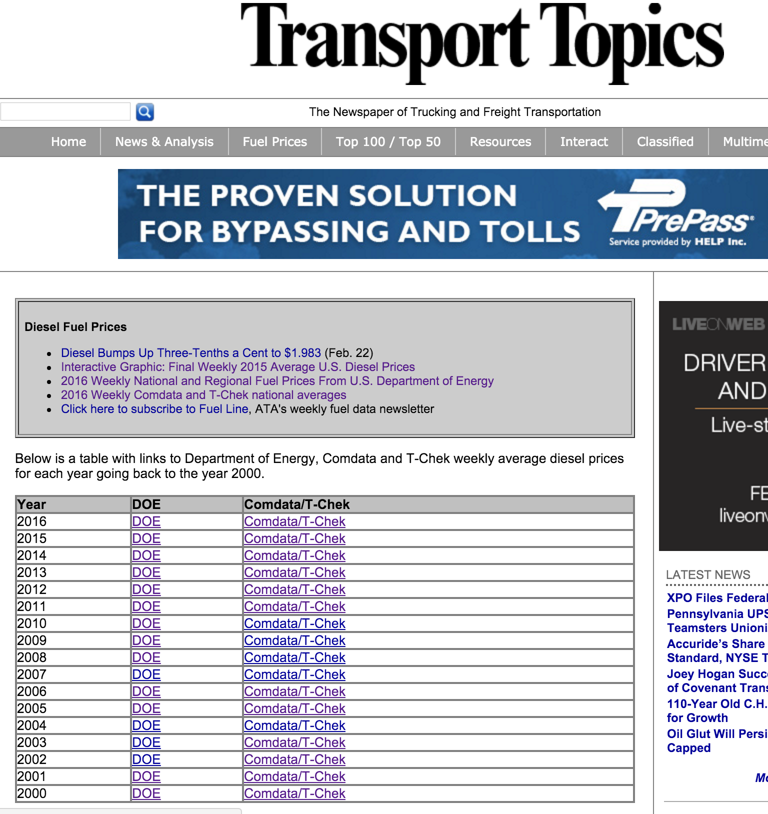
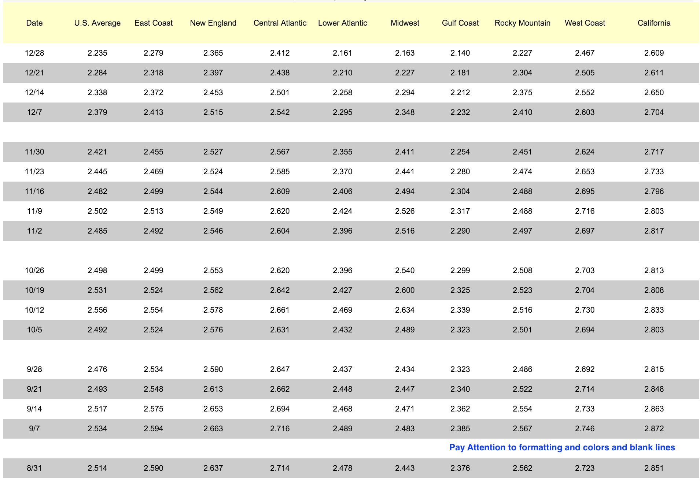
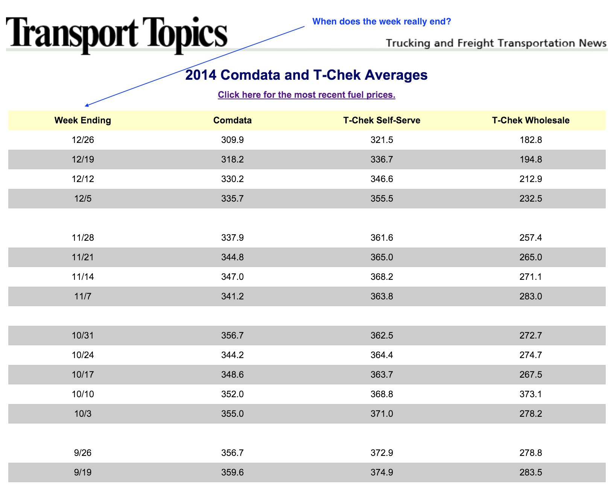

Diesel Prices & Industry Leader Scrapping  
=========================================
<br>
<br>
## "The Newspaper of Trucking and Freight Transportation" - [Transport Topics] (http://www.ttnews.com/index.aspx)

<br>
<h3>Provides info about industry including top companies and diesel prices which can be used for -

<br>
<h4> 1. connecting data about top companies with fleet census data 

<br>
<h4> 2. connecting diesel prices with profitability of the companies

<h5> **** Fuel expenses number 1 for all transportation companies
<br>

<h3><span style="color:red">Use Python for web scraping</span> 


******
<br>
<br>
## Top Companies

<br>
<h3> Different formats for different types of companies

<br>


<br>
<h3> Wanted to go a level deeper for For Hire companies but did not due to time


<br>
## Diesel Prices - Easy Peasy

<br>
<br>
<h3><span style="color:green">It is a nicely formatted HTML table<span style="color:black">


<br>

<br>


### How many different URL conventions are on this table?

<br>
```{r eval=FALSE}

DOE Fuel Prices

2016  http://www.ttnews.com/fuel/national.aspx
2015  http://www.ttnews.com/fuel/2015fuelchart.aspx
2013  http://www.ttnews.com/fuel/doeregional2013.htm
2004  http://www.ttnews.com/fuel/doeregional2004.asp
2001  http://www.ttnews.com/fuel/doeregional2000.asp
2000  http://www.ttnews.com/fuel/doeregional2000.asp ***


```

<br>
<br>
```{r eval=FALSE}

COMCheck Fuel Prices

2016  http://www.ttnews.com/fuel/comdata.aspx
2015  http://www.ttnews.com/fuel/comdata2015.htm
2005  http://www.ttnews.com/fuel/comdataopis2005.asp
2004  http://www.ttnews.com/fuel/comdata2004.asp
2001  http://www.ttnews.com/fuel/comdataopis2000.asp
2000  http://www.ttnews.com/fuel/comdataopis2000.asp ***


```

<br>
<h3> COMData & T-Check are Visa & Mastercard of fuel cards
<h3> Fuel cards are widely used in industry to control & manage costs 


<br>
<br>
## Yearly Prices - DOE and COMData/T-Check Dataset

<br>
<br>
<h3><span style="color:green">It is ALSO a nicely formatted HTML table<span style="color:black">


<br>

<br>


<h3><span style="color:green">And differs from COMCheck in terms of columns only<span style="color:black">
<br>
<br>


<br>

<br>

<br>
<br>
<br>

### How many different ways to color and style individual rows?

<br>
```{r eval=FALSE}

def get_value_row(Tag):
    return (Tag.get('align') in {'middle'}) \
        and (Tag.get('width') in {"25%"} and Tag.get('style') in {"height: 26px"}) \
        or (Tag.get('style') in {"width: 25%; height: 26px;", "width: 25%; height: 15px;"}) \
        or (Tag.get('height') in {"15px"} and Tag.get('style') in {"width: 25%"}) \
        or (Tag.get('style') in {"width: 25%"} and Tag.get('height') in {"26"}) \
        or (Tag.get('style') in {"height: 15px"} and Tag.get('width') in {"25%"}) \
        or (Tag.get('width') in {"25%"} and Tag.get('height') in {"24", "26", "27", "28" })


```

<br>
<br>
```{r eval=FALSE}


def row_colors(Tag):
    return Tag.get('bgcolor') in {'#CCCCCC','#FFFFFF','cccccc','#ffffff''#cccccc'}


```
## When does the week really end?

<br>
<br>
<h3><span style="color:green">Should be simple - we have got yearly table and column called Week Ending with dates as MM/DD<span style="color:black">

<br>
```{r eval=FALSE}


Most of the time it does end like - 12/26

But here are the other kind of values I found in those columns -
  
  3/19 - 3/23

  1/4/13
  
  12/29/2003
  
  1/3 - 1/7/11
  
  1/3-1/7/2005
  
  1/2/12 - 1/6/12
  
  2/30/2002-1/04/2003
  
  4/22-28
  
  9/9-9-13
  

```

<br>
<br>
### One minor thing about prices - most of the time they were per gallon but a few times they were per 100 gallon :)

<br>
<br>


<br>
<br>


<br>
<br>

<br>
<br>


<br>
<br>
## Why did I do it?

<br>
<h3>[U.S.Energy Information Administration] (https://www.eia.gov/) has got more than just diesel prices

<br>
<h3>[Gasoline and Diesel Fuel Update] (https://www.eia.gov/petroleum/gasdiesel/) provides historical prices even beyond 2000

<br>
<h3>[Historical Diesel Prices] (https://www.eia.gov/dnav/pet/xls/PET_PRI_GND_A_EPM0_PTE_DPGAL_W.xls) file provides lot more than DOE prices on Transport Topics

<br>


<br>
<h2> Answer:

<br>
<h3><span style="color:red">I wanted to use Python for web scraping</span> 

<br>

<br>

<br>
## Questions?


