### Introduction
We found the Forest Covertype in the UCI Machine Learning Repository that takes forestry data from the Roosevelt National Forest in northern Colorado ([Click here](https://tourbuilder.withgoogle.com/tour/ahJzfmd3ZWItdG91cmJ1aWxkZXJyEQsSBFRvdXIYgICAk5uU5AoM) for a tour of the area). The observations are taken from 30m by 30m patches of forest that are classified as one of seven forest types:

1. Spruce/Fir
2. Lodgepole Pine
3. Ponderosa Pine
4. Cottonwood/Willow
5. Aspen
6. Douglas-fir
7. Krummholz

<center>
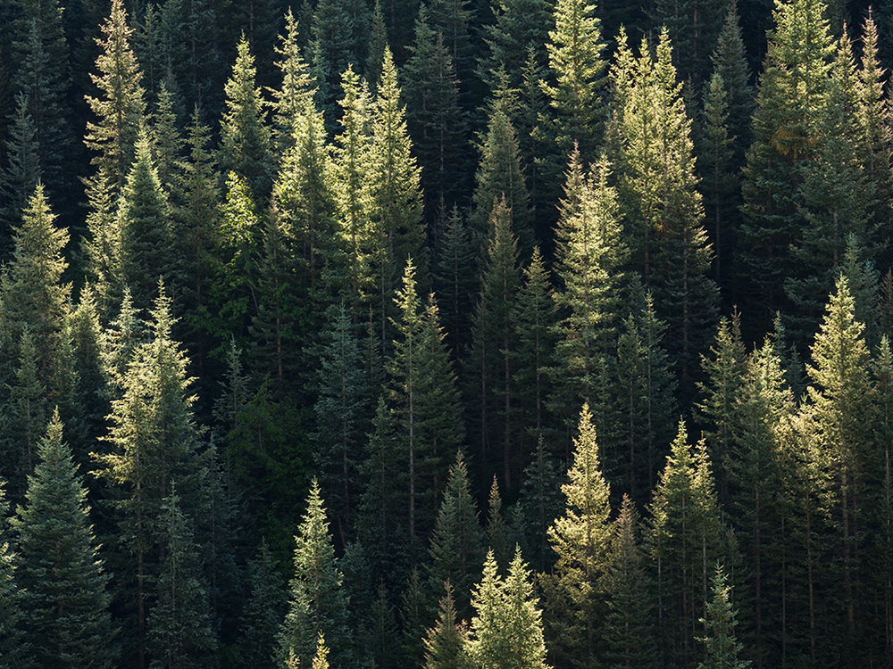
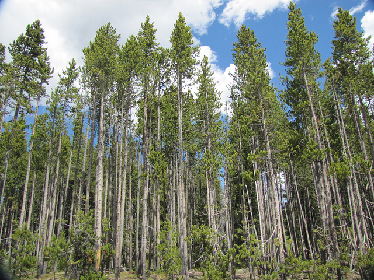
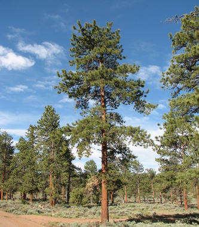
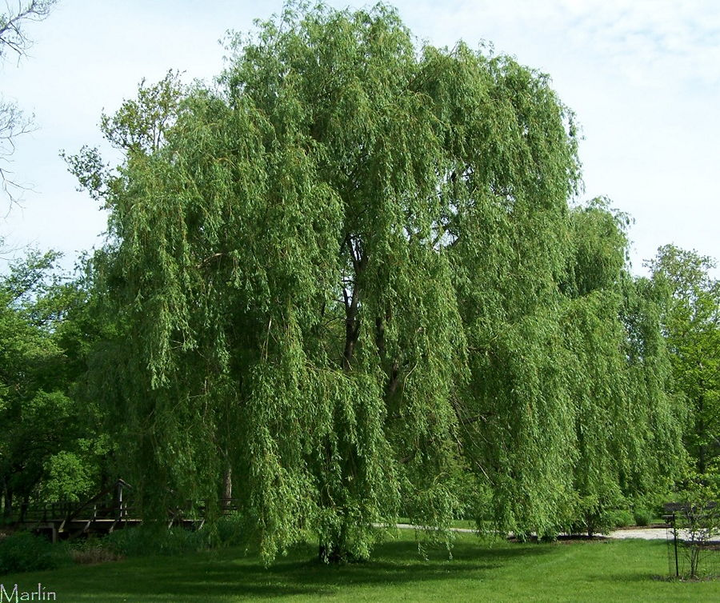</br>
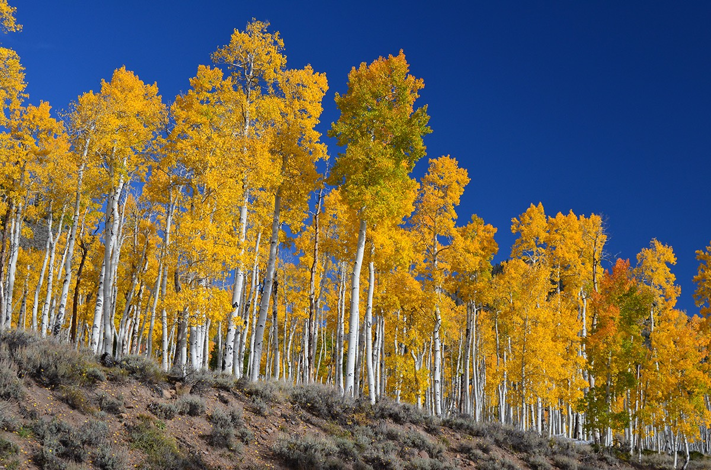
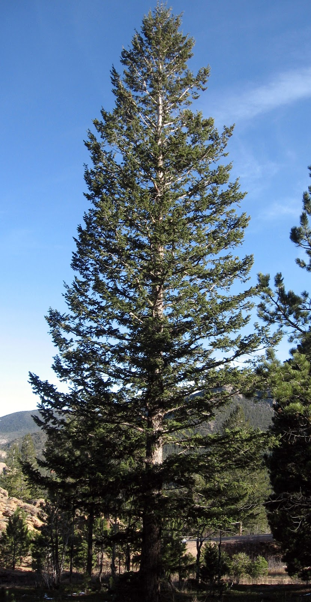

</center>

The actual forest cover type for a given observation (30 x 30 meter cell) was determined from US Forest Service (USFS) Region 2 Resource Information System (RIS) data. Kaggle hosted the dataset in a competition with a training set of 15,120 observations and a test set of 565,892 observations. The relative sizes of the training and test sets makes classification of cover type a challenging problem. We decided to use the machine learning and visualization packages available in R for this project.

```{r, echo=FALSE, message=FALSE}
# data load next 340 lines
#setwd('C://Users/Aravind/Documents/GitHub/bootcamp004_project/Project4-Machinelearning/Aravind_thomas')
#setwd('C://Users/Aravind/Documents/GitHub/bootcamp004_project/Project4-Machinelearning/Aravind_thomas')
setwd('/Users/tkolasa/dev/nycdatascience/projects/bootcamp004_project/Project4-Machinelearning/Aravind_thomas')

library(ggplot2)
library(dplyr)
library(GGally)
#library(clusterSim)
#library(VGAM)
library(caret)
library(glmnet)
library(tree)
library(randomForest)
library(gbm)
library(NISTunits)
library(plotly)

forestdata = read.csv('train.csv', header=TRUE)
# View(forestdata)
# summary(forestdata[,2:11])

# adding a new variable for covernames based on cover type

forestdata$covername = 'a'
forestdata$covername[forestdata$Cover_Type==1] = 'Spruce-fir'
forestdata$covername[forestdata$Cover_Type==2] = 'Lodgepole Pine'
forestdata$covername[forestdata$Cover_Type==3] = 'Ponderosa Pine'
forestdata$covername[forestdata$Cover_Type==4] = 'Cottonwood-Willow'
forestdata$covername[forestdata$Cover_Type==5] = 'Aspen'
forestdata$covername[forestdata$Cover_Type==6] = 'Douglas-fir'
forestdata$covername[forestdata$Cover_Type==7] = 'Krummholz'

# Create single Wilderness_Area column
forestdata$Wilderness_Area = 0
for (i in 12:15) {
  forestdata$Wilderness_Area[forestdata[,i] == 1] = i-11  
}

#plotting the correlation matrix of the quantitative factors 
forestcorrelation=cor(forestdata[,2:11])

#creating mean of hillshade
forestdata$Hillshade_mean = (forestdata$Hillshade_9am + forestdata$Hillshade_3pm + forestdata$Hillshade_Noon) / 3


#creating distance to hydrology as a function of horizontal and vertical 
forestdata$Euclidean_Distance_To_Hydrology = (forestdata$Horizontal_Distance_To_Hydrology^2 + forestdata$Vertical_Distance_To_Hydrology^2)^.5

forestdata$Aspect[forestdata$Aspect == 360] = 0

rose_diagram_df = forestdata[c('Aspect', 'covername')]

rose_diagram_df['aspect_group'] = cut(rose_diagram_df$Aspect, breaks=c(-1,seq(20,360, by = 20)), labels=FALSE)

forestdata$aspect_group=rose_diagram_df$aspect_group
forestdata$aspect_group_shift= forestdata$aspect_group+3
forestdata$aspect_group_shift[forestdata$aspect_group_shift==19]= 1 
forestdata$aspect_group_shift[forestdata$aspect_group_shift==20]= 2 
forestdata$aspect_group_shift[forestdata$aspect_group_shift==21]= 3 

# Create single Soil_Type column
forestdata$Soil_Type = 0
for (i in 16:55) {
  forestdata$Soil_Type[forestdata[,i] == 1] = i-15  
}

#Create log Elevation 
forestdata$log_elevation=log(forestdata$Elevation)

#Squared Hillshades 
forestdata$Hillshade_9am_sq=forestdata$Hillshade_9am^2
forestdata$Hillshade_noon_sq=forestdata$Hillshade_Noon^2
forestdata$Hillshade_3pm_sq=forestdata$Hillshade_3pm^2

#Cosine of Slope
forestdata$cosine_slope=cos(NISTdegTOradian(forestdata$Slope))

#Whether aspect group shift is < 10 or not 
forestdata$aspect_group_class=as.numeric(forestdata$aspect_group_shift)

for (i in 1:nrow(forestdata)) {
  if (forestdata$aspect_group_class[i]>10) {
    forestdata$aspect_group_class[i]=0 
  } else {
     forestdata$aspect_group_class[i]=1
   }
}

forestdata$aspect_group_class=as.factor(forestdata$aspect_group_class)

# Group families 

soil_family=c(1, 2, 3, 4, 2, 2, 5, 6, 7, 8, 8, 9, 10, 11, 12, 13, 14, 15, 13, 14, 15, 16, 16, 16,
  16, 17, 16, 16, 18, 18, 16, 10, 16, 19, 20, 21, 20, 16, 19, 19)

forestdata$soil_family=as.numeric(forestdata$Soil_Type)

for (i in 1:nrow(forestdata)) {
forestdata$soil_family[i]=soil_family[forestdata$soil_family[i]]
}

forestdata$soil_family=as.factor(forestdata$soil_family)

rock_type=c('stony', 'stony', 'rubbly', 'rubbly', 'rubbly', 'stony', 'neither', 'neither', 'stony', 'rubbly', 'rubbly', 
  'stony', 'rubbly', 'neither', 'neither', 'neither', 'neither', 'stony', 'neither', 'neither', 'neither', 
  'stony', 'neither', 'stony', 'stony', 'stony', 'stony', 'stony', 'stony', 'stony', 'stony', 'stony', 
  'stony', 'stony', 'neither', 'stony', 'stony', 'stony', 'stony', 'stony')

rock_type_factor = c(1,2,3)
rock_type=rock_type_factor[as.factor(rock_type)]

#3 - stony, 1 -neither 2- rubbly 

forestdata$soil_rock_type=as.numeric(forestdata$Soil_Type)

for (i in 1:nrow(forestdata)) {
forestdata$soil_rock_type[i]=rock_type[forestdata$soil_rock_type[i]]
}

forestdata$soil_rock_type=as.factor(forestdata$soil_rock_type)
#interaction between hillshade noon and 9 am 

forestdata$interaction_9amnoon= forestdata$Hillshade_9am*forestdata$Hillshade_Noon
forestdata$interaction_noon3pm=forestdata$Hillshade_Noon*forestdata$Hillshade_3pm
forestdata$interaction_9am3pm= forestdata$Hillshade_9am*forestdata$Hillshade_3pm


#################### converting to factors ########################

forestdata$Soil_Type=as.factor(forestdata$Soil_Type)
forestdata$Wilderness_Area=as.factor(forestdata$Wilderness_Area)

forestdata$covername=as.factor(forestdata$covername)
forestdata$Cover_Type=as.factor(forestdata$Cover_Type)
forestdata$aspect_group=as.factor(forestdata$aspect_group)
forestdata$aspect_group_shift=as.factor(forestdata$aspect_group_shift)

forestdata1= forestdata[,-c(22,30)]

for(i in 12:53) {
  forestdata1[,i]= as.factor(forestdata1[,i])
}

temp=forestdata1[,1:54]
forestdata2=forestdata1
forestdata1=temp

# replicating the feature  creations with TEST data set 

foresttest = read.csv('test.csv', header = TRUE)
foresttest$Cover_Type = sample(1:7, nrow(foresttest), replace = TRUE)
testmodel=foresttest[,-c(22,30)]
for(i in 12:54) {
  testmodel[,i] = as.factor(testmodel[,i])
}

foresttest$Soil_Type = 0
for (i in 16:55) {
  foresttest$Soil_Type[foresttest[,i] == 1] = i-15  
}
foresttest$Wilderness_Area = 0
for (i in 12:15) {
  foresttest$Wilderness_Area[foresttest[,i] == 1] = i-11  
}

foresttest$Soil_Type = as.factor(foresttest$Soil_Type)
foresttest$Wilderness_Area = as.factor(foresttest$Wilderness_Area)
foresttest$Cover_Type = as.factor(foresttest$Cover_Type)

# adding a new variable for covernames based on cover type

foresttest$covername = 'a'
foresttest$covername[foresttest$Cover_Type==1] = 'Spruce-fir'
foresttest$covername[foresttest$Cover_Type==2] = 'Lodgepole Pine'
foresttest$covername[foresttest$Cover_Type==3] = 'Ponderosa Pine'
foresttest$covername[foresttest$Cover_Type==4] = 'Cottonwood-Willow'
foresttest$covername[foresttest$Cover_Type==5] = 'Aspen'
foresttest$covername[foresttest$Cover_Type==6] = 'Douglas-fir'
foresttest$covername[foresttest$Cover_Type==7] = 'Krummholz'

#creating mean of hillshade
foresttest$Hillshade_mean = (foresttest$Hillshade_9am + foresttest$Hillshade_3pm + foresttest$Hillshade_Noon) / 3

#creating distance to hydrology as a function of horizontal and vertical 
foresttest$Euclidean_Distance_To_Hydrology = (foresttest$Horizontal_Distance_To_Hydrology^2 + foresttest$Vertical_Distance_To_Hydrology^2)^.5

foresttest$Aspect[foresttest$Aspect == 360] = 0

rose_diagram_df = foresttest[c('Aspect', 'covername')]

rose_diagram_df['aspect_group'] = cut(rose_diagram_df$Aspect, breaks=c(-1,seq(20,360, by = 20)), labels=FALSE)

foresttest$aspect_group=rose_diagram_df$aspect_group
foresttest$aspect_group_shift= foresttest$aspect_group+3
foresttest$aspect_group_shift[foresttest$aspect_group_shift==19]= 1 
foresttest$aspect_group_shift[foresttest$aspect_group_shift==20]= 2 
foresttest$aspect_group_shift[foresttest$aspect_group_shift==21]= 3 


#Create log Elevation 
foresttest$log_elevation=log(foresttest$Elevation)

#Squared Hillshades 
foresttest$Hillshade_9am_sq=foresttest$Hillshade_9am^2
foresttest$Hillshade_noon_sq=foresttest$Hillshade_Noon^2
foresttest$Hillshade_3pm_sq=foresttest$Hillshade_3pm^2

#Cosine of Slope
foresttest$cosine_slope=cos(NISTdegTOradian(foresttest$Slope))

#Whether aspect group shift is < 10 or not 
foresttest$aspect_group_class=as.numeric(foresttest$aspect_group_shift)
foresttest$aspect_group_class=0

foresttest$aspect_group_class[foresttest$aspect_group_shift >10]=1

foresttest$aspect_group_class=as.factor(foresttest$aspect_group_class)

# Group families 

soil_family=c(1, 2, 3, 4, 2, 2, 5, 6, 7, 8, 8, 9, 10, 11, 12, 13, 14, 15, 13, 14, 15, 16, 16, 16,
              16, 17, 16, 16, 18, 18, 16, 10, 16, 19, 20, 21, 20, 16, 19, 19)

foresttest$soil_family=as.numeric(foresttest$Soil_Type)

foresttest$soil_family=soil_family[foresttest$soil_family]

foresttest$soil_family=as.factor(foresttest$soil_family)

rock_type=c('stony', 'stony', 'rubbly', 'rubbly', 'rubbly', 'stony', 'neither', 'neither', 'stony', 'rubbly', 'rubbly', 
            'stony', 'rubbly', 'neither', 'neither', 'neither', 'neither', 'stony', 'neither', 'neither', 'neither', 
            'stony', 'neither', 'stony', 'stony', 'stony', 'stony', 'stony', 'stony', 'stony', 'stony', 'stony', 
            'stony', 'stony', 'neither', 'stony', 'stony', 'stony', 'stony', 'stony')

rock_type_factor = c(1,2,3)
rock_type=rock_type_factor[as.factor(rock_type)]

#3 - stony, 1 -neither 2- rubbly 

foresttest$soil_rock_type=as.numeric(foresttest$Soil_Type)

foresttest$soil_rock_type=rock_type[foresttest$Soil_Type]

foresttest$soil_rock_type=as.factor(foresttest$soil_rock_type)
#interaction between hillshade noon and 9 am 

foresttest$interaction_9amnoon= foresttest$Hillshade_9am*foresttest$Hillshade_Noon
foresttest$interaction_noon3pm=foresttest$Hillshade_Noon*foresttest$Hillshade_3pm
foresttest$interaction_9am3pm= foresttest$Hillshade_9am*foresttest$Hillshade_3pm


xfactors <- model.matrix(forestdata$Cover_Type ~ forestdata$Elevation +
                           forestdata$Aspect +
                           forestdata$Slope +
                           forestdata$Horizontal_Distance_To_Hydrology +
                           forestdata$Vertical_Distance_To_Hydrology +
                           forestdata$Horizontal_Distance_To_Roadways +
                           forestdata$Hillshade_9am +
                           forestdata$Hillshade_Noon +
                           forestdata$Hillshade_3pm +
                           forestdata$Horizontal_Distance_To_Fire_Points +
                           forestdata$Wilderness_Area +                  #removes the first area
                           forestdata$Wilderness_Area1 +
                           forestdata$Horizontal_Distance_To_Fire_Points +
                           forestdata$Soil_Type +
                           forestdata$Soil_Type1)[,-1]
x=as.matrix(xfactors)

set.seed(0)
train = sample(1:nrow(x), 85*nrow(x)/100)
test = (-train)

y = forestdata$Cover_Type
y.test = y[test]

xfactorstest <- model.matrix(foresttest$Cover_Type ~ foresttest$Elevation +
                               foresttest$Aspect +
                               foresttest$Slope +
                               foresttest$Horizontal_Distance_To_Hydrology +
                               foresttest$Vertical_Distance_To_Hydrology +
                               foresttest$Horizontal_Distance_To_Roadways +
                               foresttest$Hillshade_9am +
                               foresttest$Hillshade_Noon +
                               foresttest$Hillshade_3pm +
                               foresttest$Horizontal_Distance_To_Fire_Points +
                               foresttest$Wilderness_Area +
                               foresttest$Wilderness_Area1 +
                               foresttest$Soil_Type +
                               foresttest$Soil_Type1)[,-1]
xtest=as.matrix(xfactorstest)

xtest = xtest[, -c(20, 28)]

foresttest1= foresttest[,-c(22,30)]

foresttest1$Soil_Type = 0
for (i in 12:53) {
  foresttest1[,i]=as.factor(foresttest1[,i])
}

foresttest$Soil_Type=as.factor(foresttest$Soil_Type)
foresttest$Wilderness_Area=as.factor(foresttest$Wilderness_Area)

foresttest$covername=as.factor(foresttest$covername)
foresttest$Cover_Type=as.factor(foresttest$Cover_Type)
foresttest$aspect_group=as.factor(foresttest$aspect_group)
foresttest$aspect_group_shift=as.factor(foresttest$aspect_group_shift)
foresttest$soil_family=as.factor(foresttest$soil_family)
foresttest$aspect_group_class=as.factor(foresttest$aspect_group_class)

foresttest1$Soil_Type=as.factor(foresttest1$Soil_Type)
foresttest1$Wilderness_Area=as.factor(foresttest1$Wilderness_Area)

foresttest1$soil_family=as.factor(foresttest1$soil_family)
foresttest1$covername=as.factor(foresttest1$covername)
foresttest1$Cover_Type=as.factor(foresttest1$Cover_Type)
foresttest1$aspect_group=as.factor(foresttest1$aspect_group)
foresttest1$aspect_group_shift=as.factor(foresttest1$aspect_group_shift)
foresttest1$aspect_group_class=as.factor(foresttest1$aspect_group_class)

#create wilderness area names
forestdata$Wilderness_Area_names = 0
forestdata$Wilderness_Area_names[forestdata$Wilderness_Area == 1] = "Rawah"
forestdata$Wilderness_Area_names[forestdata$Wilderness_Area == 2] = "Neota"
forestdata$Wilderness_Area_names[forestdata$Wilderness_Area == 3] = "Comanche Peak"
forestdata$Wilderness_Area_names[forestdata$Wilderness_Area == 4] = "Cache la Poudre"
```


### Data Exploration

Name                                | Measurement                   |    Description
------------------------------------|-------------------------------|----------------------------------------------------
Elevation                           |    meters                     |  Elevation in meters
Aspect                              |    azimuth                    |  Aspect in degrees azimuth
Slope                               |    degrees                    |  Slope in degrees
Horizontal Distance To Hydrology    |    meters                     |  Horz Dist to nearest surface water features
Vertical Distance To Hydrology      |    meters                     |  Vert Dist to nearest surface water features
Horizontal Distance To Roadways     |    meters                     |  Horz Dist to nearest roadway
Hillshade 9am                       |    0 to 255 index             |  Hillshade index at 9am, summer solstice
Hillshade Noon                      |    0 to 255 index             |  Hillshade index at noon, summer soltice
Hillshade 3pm                       |    0 to 255 index             |  Hillshade index at 3pm, summer solstice
Horizontal Distance To Fire Points  |    meters                     |  Horz Dist to nearest wildfire ignition points
Wilderness Area (4 binary columns)  |    0 (absence) or 1 (presence)|  Wilderness area designation
Soil Type (40 binary columns)       |    0 (absence) or 1 (presence)|  Soil Type designation
Cover Type                          |    Classes 1 to 7             |  Forest Cover Type designation - Response Variable


Some class seperation is clearly visible in the following plots of elevation.
```{r, echo=FALSE,fig.width=8,fig.height=4.5,dpi=300,out.width="1200px",height="800px",message=FALSE}
# ggplot(forestdata, aes(x=Elevation)) + geom_histogram(aes(group=covername, fill=covername), alpha=.8, bins = 50) + ggtitle('Elevation Histogram') + scale_fill_discrete(name='Forest Cover Type') + theme(legend.position = "bottom") + xlab('Elevation (m)')
# ggplot(forestdata, aes(x=Elevation)) + geom_density() + ggtitle('Elevation Density Plot') + xlab('Elevation (m)')
# ggplot(forestdata, aes(x=Elevation)) + geom_density(aes(group=covername, fill=covername), alpha=0.3) + ggtitle('Elevation Density Plots by Cover Type') + scale_fill_discrete(name='Forest Cover Type') + theme(legend.position = "bottom") + xlab('Elevation (m)')
```

Another compelling variable is aspect, or the cardinal direction that the slope has the steepest gradient downwards. For example, in the rose diagram below, there are more Douglas-Fir trees for observations with northern aspects (near 0º) than southern aspects (near 180º).

Across Wilderness areas, there seems to be some class seperation . Cottonwood Willow covers are found only in Cache la Poudre areas and Neota area comprises of only Spruce-fir,Krummholz and LodgePole-Pine covers. 

<center>
```{r, echo=FALSE, message=FALSE}
# ggplot(forestdata, aes(x=Wilderness_Area, fill=covername)) + geom_bar(aes(y=(..count..)/sum(..count..))) + ggtitle('Proportion of Observations by Wilderness Area') + ylab('Proportion') + xlab(NULL) + theme(legend.title=element_blank()) +
#   scale_x_discrete(breaks = 1:4, labels=c("Rawah","Neota","Camanche Peak","Cache la Poudre"))
```

```{r, echo=FALSE, out.width="1100px",height="600px", message=FALSE}
# ggplot(forestdata, aes(x=Soil_Type, fill=covername)) + geom_bar(aes(y=(..count..)/sum(..count..))) + ggtitle('Proportion of Observations by Soil Type') + ylab('Proportion') + xlab(NULL) + theme(legend.title=element_blank(), legend.position='bottom') +
#   scale_x_discrete(breaks = 1:40)
```


```{r, echo=FALSE,fig.width=8,fig.height=4.5,dpi=300,out.width="1200px",height="800px",message=FALSE}
# ggplot(forestdata, aes(x=aspect_group, fill=covername) ) + ggtitle("Aspect by Cover Type") + 
#   geom_bar() + theme(legend.title=element_blank(), axis.title.x=element_blank(), axis.text.x=element_blank()) +
#   coord_polar()
# 
#  ggplot(forestdata, aes(x=aspect_group, fill=Wilderness_Area_names )) + ggtitle("Aspect by Wilderness Area") + 
#   geom_bar() + theme(legend.title=element_blank(), axis.title.x=element_blank(), axis.text.x=element_blank()) +
#   coord_polar()
```


```{r, echo=FALSE, fig.width=18, fig.height=18, dpi=300}
# columnlables <- c('Elevation', 'Aspect', 'Slope', 'Water Dist', 'Water Dist Vert', 'Road Dist', 'Hillshade 9AM', 'Hillshade Noon', 'Hillshade 3PM', 'Fire Point Dist')
# ggpairs(data = forestdata, columns = 2:11, title = "Correlations", mapping = aes(colour = Cover_Type, alpha = .3), columnLabels = columnlables)

```
</center>


One of the clearer relationships in the dataset was the distribution of Hillshade luminance. Hillshade is measured on a scale from 0 to 255 (dark to bright).

Hillshade at time *t* varies as a factor of:
$$\cos(slope)\cos (90- Altitude) + \sin (slope)\sin (90-Altitude)\cos(Azimuth-Aspect)$$ 
where Altitude is the angle of the Sun relative to the horizon and Azimuth relates to the direction the Sun is facing: North, South, East, or West. Azimuth of 90 degrees corresponds to East.

This equation actually arises from a theorem in Spherical geometry known as "Spherical law of Cosines" relating the sides and angles of triangles constructed on spherical surfaces.  

<center></center>
<br>
In a unit sphere, lengths *a*, *b*, *c* correspond to the angle subtended by those sides from the center of the sphere. 
If we know the two sides *a*, *b* and the angle between them *C*, then the cosine of *c*, is given by:


In short, the Illumination of the patch is related to alitude of the sun, slope of the terrain and the relative direction of the sun and the slope. 

$Hillshade(t_1,t_2,t_3)$ has has been plotted below in 3 dimensions:


```{r, echo=F, message=F, dpi=300, out.width='1000px',out.height='1000px'}
#plot_ly(forestdata, x = Hillshade_9am, y = Hillshade_Noon, z = Hillshade_3pm, type = "scatter3d", mode = "markers", color = covername)
```


More importantly, in the context of class seperation, The following plot of elevation, slope, and hillshade clearly seperates the forest cover types, demonstrating that elevation could be the most significant factor in determining cover type. 

```{r, echo=F, message=F, dpi=300, out.width='1000px',out.height='1000px'}
#plot_ly(forestdata, x =Elevation, y = Slope, z = Hillshade_9am, type = "scatter3d", mode = "markers", color = covername)
```


The primary reason for the collection of cartographic data pertains to terrain mapping and is ultimately useful for applying topographic correction to satellite images in remote sensing or as background information in scientific studies.

Topographic correction is necessary if, for example, we wish to identify materials on the Earth's surface by deriving empirical spectral signatures, or to compare images taken at different times with different Sun and satellite positions and angles. By applying the corrections, it is possible to  transform the satellite-derived reflectance into their true reflectivity or radiance in horizontal conditions.


## Modeling
<center>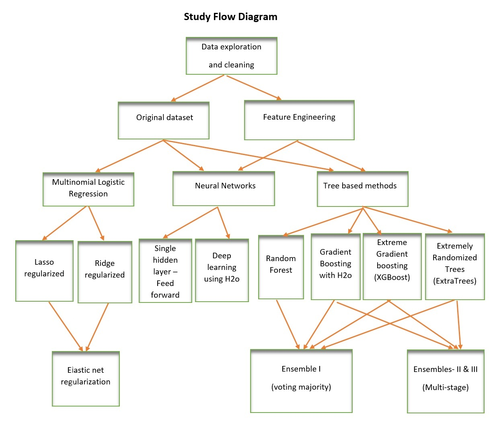</center>


### Logistic Regression

We first investigated multinomial logistic regression. Since classical multiple regression in sensitive to high variance of coefficient estimates in cases of correlated predictor variables, we decided to use the *glmnet* package, which executes logistic regressions with regularization. Using the dataset *x*, the probability of the response class *k* of 1 through 7 is the following:

$$\mbox{Pr}(G=k|X=x)=\frac{e^{\beta_{0k}+\beta_k^Tx}}{\sum_{\ell=1}^7e^{\beta_{0\ell}+\beta_\ell^Tx}}$$

We then transfer this into the elastic-net penalized negative log-likelihood function (the first term of the following equation):

$$\ell(\{\beta_{0k},\beta_{k}\}_1^7) = -\left[\frac{1}{N} \sum_{i=1}^N \Big(\sum_{k=1}^7y_{il} (\beta_{0k} + x_i^T \beta_k)- \log \big(\sum_{k=1}^7 e^{\beta_{0k}+x_i^T \beta_k}\big)\Big)\right] +\lambda \left[ (1-\alpha)||\beta||_F^2/2 + \alpha\sum_{j=1}^p||\beta_j||\right]$$

Where *k* is the response class (cover type from 1 to 7) and *N* is the number of observations.
The second term in the equation represents the regularization term.

The elastic net penalty $\alpha$ varies from 0 to 1. When $\alpha = 0$, the function reduces to Ridge regularization. When $\alpha = 1$, Lasso regularization is used. The Ridge penalty shrinks the coefficients of closely correlated predictors wheras the Lasso tries to pick one and discard others.


#### Ridge Regularization

We performed 10-fold cross validation on a ridge regularization and on a grid of 100 values of $\lambda$, choosing the minimum $\lambda$ for each model. When we ran the regression with a 70-30 cross validation split on the training set, we got an accuracy on the test set on Kaggle of **0.5570**. 

When we reran the ridge regression with an 85-15 split on the training data, we got a Kaggle accuracy of **0.5956** (1,414th place). Since the test set is so much larger than our training set, it was beneficial to incorporate a larger proportion of the data for learning within the training data before runnint the model on the larger testing data.

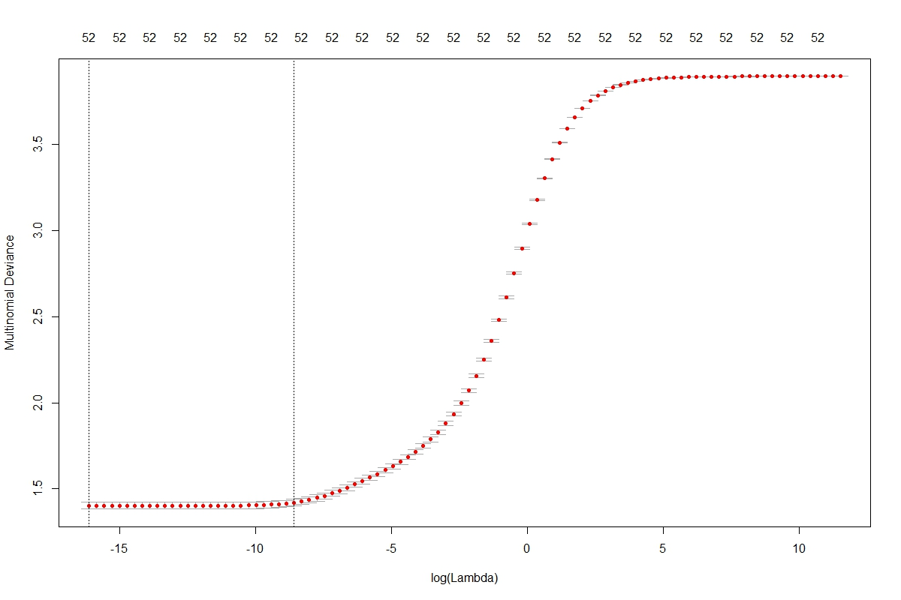

#### Lasso Regularization

A 10-fold cross validated lasso-regularized logistic regression kaggle score was **0.59594** for 70-30 split kaggle score of **0.59526**, for 85-15 split kaggle score of **0.59443** if we took the lowest 50 percintile of lambdas and calculated the mode of the predictions.

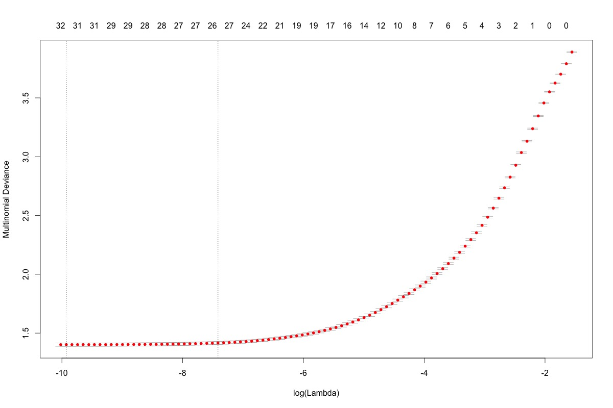

#### Elastic-net Regularization

Using both the ridge and lasso regularization terms concurrently produces an elastic-net regularization. We ran this hybrid method with both a 70-30 split and 85-15 split in the training set. When running these models on the testing set, we got accuracies on Kaggle of **0.5959** and **0.5952**, respectively.

We also tried an elastic-net regression using all 15,120 observations in the training set. It earned an accuracy score on the testing set of **0.5950**.

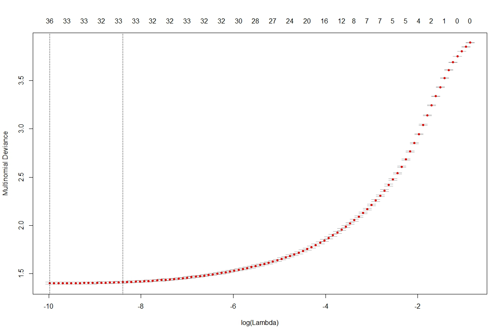


### Artificial Neural Networks
An artificial neural network is a combination of simple processing elements that convert input information into response output. 

The complexity of these models makes the relationships between nodes highly variable and difficult to interpret, giving neural networks the reputation of "black box" models. 

We first modeled the data in a feed-forward neural network with a single layer of nodes. Later, we created deep learning models where we added more layers of hidden nodes.

#### Single Hidden Layer Using the nnet Package
The Nnet R library allows the construction of feed-forward single-layer nerual networks. After scaling our variables, we experimented to see the optimal number of nodes for our hidden layer.

<center>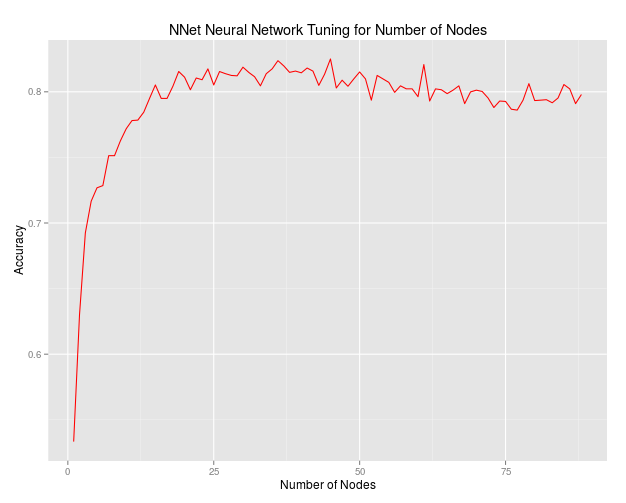</center>

We ran 25 node neural nets on our training data achieving **0.5087** accuracy for 300 maximum iterations [per node?????] and **0.5149** accuracy for 500 maximum iterations.

#### Deep Learning using H2O
For adding multiple hidden layers, we used H2O. H2O is an R package that runs parallel-distributed machine learning algorithms to improve computational speed. 


### Random Forest
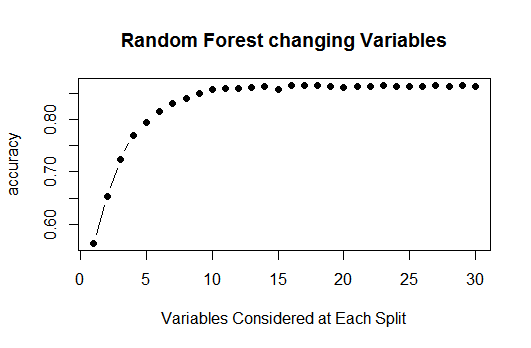


#### Boosting Using XGBoost
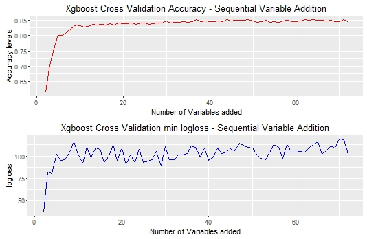

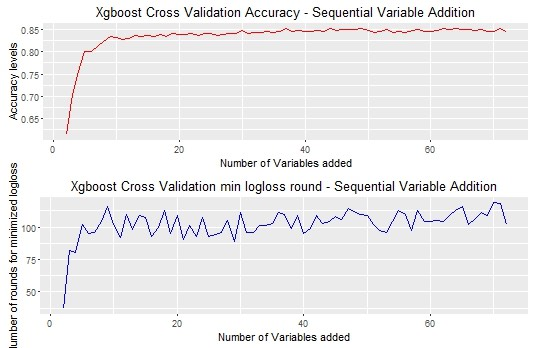
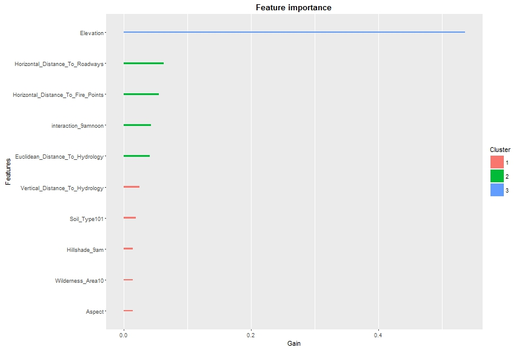
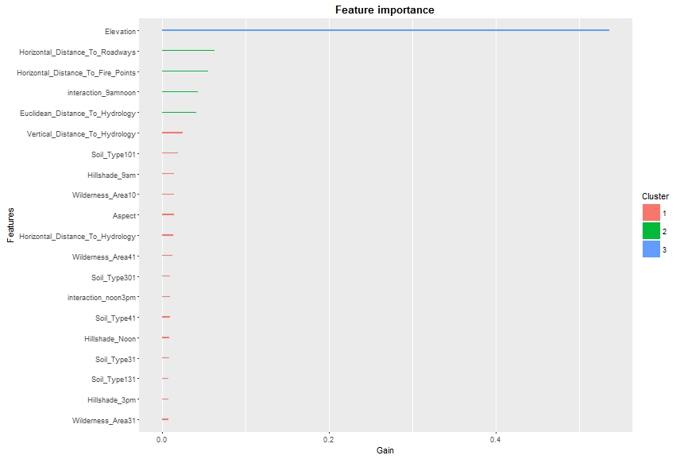
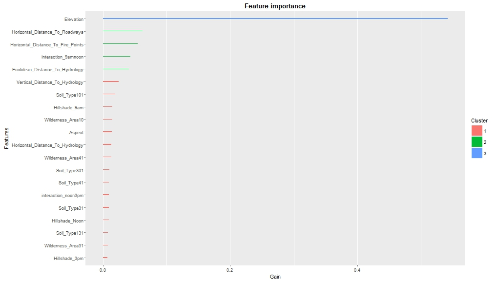

#### Boosting Using H2O's Gradient Boosting Algorithm

#### Extremely Randomized Trees
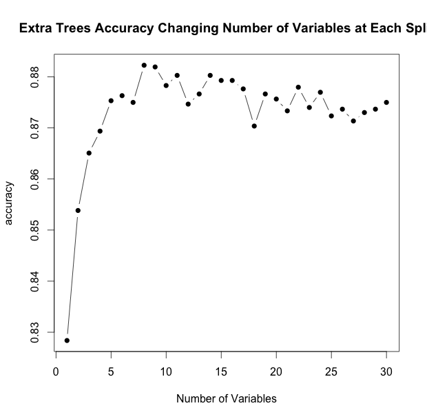
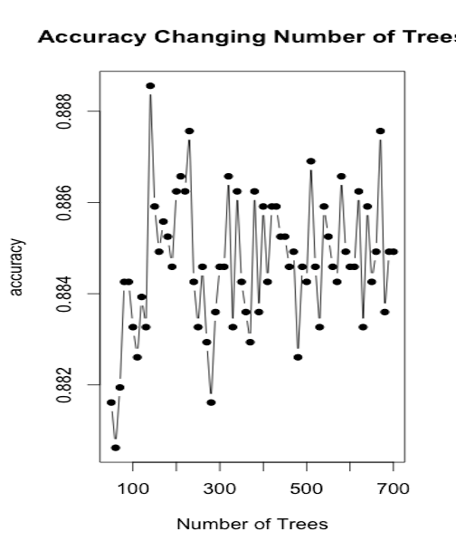
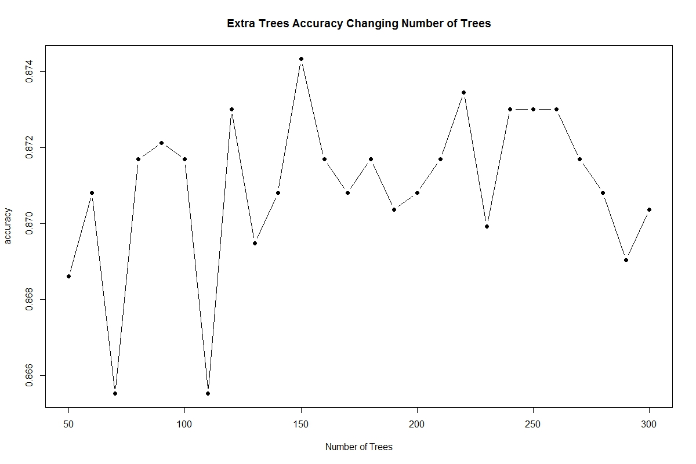


### Support Vector Machines ?


#### Ensembling


## Results Summary

Model
-------------------
Logistic Regression - 
Ridge
Lasso
Elastic-net


## Conclusion


## References:

- https://en.wikipedia.org/wiki/Spherical_law_of_cosines
- https://scientiaplusconscientia.wordpress.com/2014/12/16/hillshading-useful-fun-with-digital-elevation-models/
- https://scientiaplusconscientia.wordpress.com/2014/08/06/working-with-modis-l1b-from-scratch-4-topographic-and-illumination-correction/
- http://www.geography.hunter.cuny.edu/~jochen/GTECH361/lectures/lecture11/concepts/Hillshade.htm
- https://upload.wikimedia.org/wikipedia/commons/3/38/Law-of-haversines.svg
- https://web.stanford.edu/~hastie/glmnet/glmnet_alpha.html
